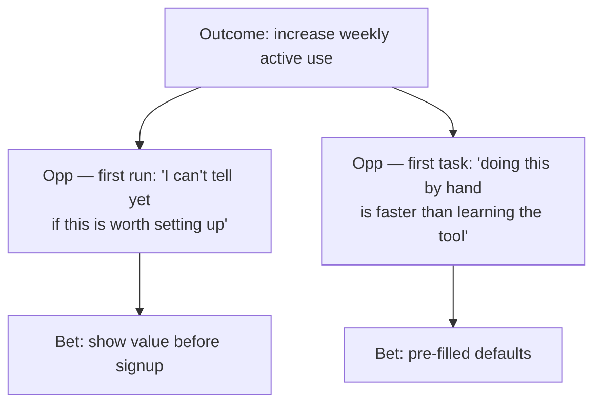

# Extracted from layers.jamiemill.com.html

Title: Layers — AI skills for product designers

Description: AI skills for product designers — guidance through the seven layers of product design.

## Links found

- #install
- /
- /#skills
- /_astro/BaseLayout.B7_mc1i3.css
- /_astro/index@_@astro.CEEjLwjp.css
- /about
- /favicon.svg
- /skills
- /skills/conceptual-model
- /skills/domain
- /skills/interaction-flow
- /skills/observed-behaviour
- /skills/orient
- /skills/product-strategy
- /skills/surface
- /skills/user-needs
- https://fonts.googleapis.com
- https://fonts.googleapis.com/css2?family=Plus+Jakarta+Sans:ital,wght@0,300;0,400;0,500;0,600;0,700;0,800;1,300;1,400;1,500;1,600;1,700&display=swap
- https://fonts.gstatic.com
- https://github.com/jamiemill/layers-skills
- https://github.com/jamiemill/layers-skills/blob/main/LICENSE
- https://jamiemill.com

## Body text

Layers — AI skills for product designers 
 [Layers ](/)  [Skills ](/skills)  [About ](/about)  [Install ](#install) 

AI Skills Pack 

Design beyond the surface. 

Whether you're directing your AI or working alongside it, Layers
            walks you both through all seven layers of product design — so the
            decisions underneath the screen actually get made. 

Install in Claude Code, Cursor, Codex & more 

npx skills add jamiemill/layers-skills Copy Copied 
Install once with the skills package, then run any /layers-* skill
      in your AI tool. 

Works with 
Claude Code 

Cursor 

OpenAI Codex 

pi.dev 

+ 50 more 

 [Open source · github.com/jamiemill/layers-skills ](https://github.com/jamiemill/layers-skills) 

The framework 

Seven layers, three zones 

Most product design decisions live at one of seven layers. It's easy —
          for humans and for AI — to stay near the surface; plausible screens
          come quickly, and the decisions underneath them go unmade. Layers
          gives you a way to navigate down, find which layer the real problem
          lives at, and run the skill that thinks with you there. 

Solution Space 
Deliberate decisions about what to build. 
 [07 Surface → ](/skills/surface)  [06 Interaction structure & flow → ](/skills/interaction-flow)  [05 Conceptual model → ](/skills/conceptual-model)  [04 Product & service strategy → ](/skills/product-strategy) Problem Space 
Knowledge gathered from reality. 
 [03 User needs → ](/skills/user-needs)  [02 The domain → ](/skills/domain)  [01 Observed behaviour → ](/skills/observed-behaviour) Reality 
Complex, contradictory, evolving — the source of all learning. 

Reality 
Not sure where to start?  [Run /layers-orient ](/skills/orient) — it audits
        all seven layers and tells you which one is your bottleneck. 

 [Browse all 9 skills → ](/skills) 

In practice 

What you'd actually say 

These are the kinds of prompts the Layers skills are built to handle.
          Drop one into your AI tool — the skill takes it from there. 

Start broad 

When you don't yet know which layer the problem lives at. 

I've been asked to redesign onboarding — use the Layers skills to help me think it through properly. 

Help me figure out why my team can't agree on how to design this feature. Use Layers to surface what we're actually disagreeing about. 

I'm stuck on this design and I don't know what's wrong. Use Layers to diagnose where the real problem is. 

Audit my mockups with the Layers skills — what decisions am I assuming, and which ones haven't actually been made? 

Or go straight to a layer 

When you know which decisions you need to make. 

I've got 12 user interviews. Run  [/layers-user-needs ](/skills/user-needs) and turn them into prioritised job stories. 

Help me model the objects, relationships, and vocabulary for this scheduling tool with  [/layers-conceptual-model ](/skills/conceptual-model) . 

Run  [/layers-interaction-flow ](/skills/interaction-flow) for this checkout — surface the edge cases and empty states I'm missing. 

My team can't agree on terminology across product, design, and engineering. Use  [/layers-domain ](/skills/domain) to map the conflicts. 

What you get back 

Decisions, not screens. 

Skills capture design decisions as markdown and mermaid — job
            stories, strategy trees, object maps, breadboards, decision
            inventories. Plain text, readable by humans, by AI, and by every
            other tool you use. 

Need decisions to live in Linear, Notion, Figma, or GitHub instead?
            Connect an MCP and the skill writes there directly. 
Example artifact Output from /layers-product-strategy 

Preview Markdown 

Strategy tree 
graph TD
    O["Outcome: increase weekly active use"]
    O --> Op1["Opp — first run: 'I can't tell yet if this is worth setting up'"]
    O --> Op2["Opp — first task: 'doing this by hand is faster than learning the tool'"]
    Op1 --> B1["Bet: show value before signup"]
    Op2 --> B2["Bet: pre-filled defaults"] 
Prioritised bet: show value before signup. 

Risk: cold visitors may not engage enough to surface real
                  value. 

Validation: cohort A/B on signup conversion + qualitative
                  session review. 

Linked needs: #user-needs/onboarding-momentum 

## Strategy tree

**Prioritised bet:** show value before signup.

- *Risk:* cold visitors may not engage enough to surface real value.
- *Validation:* cohort A/B on signup conversion + qualitative session review.
- *Linked needs:* `#user-needs/onboarding-momentum` 

About 

The Layers framework, made available to AI. 

Layers is a model of product design as seven layers across three zones.
        The framework is by  [Jamie Mill ](https://jamiemill.com) ; the skills make it
        executable inside the AI tools you already use. 

 [More about the framework → ](/about) 

Install 

Install in Claude Code, Cursor, Codex & more 

npx skills add jamiemill/layers-skills Copy Copied 
Install once with the skills package, then run any /layers-* skill
      in your AI tool. 

Layers 

 [Home ](/) 

 [Skills ](/#skills) 

 [About ](/about) 

Elsewhere 

 [jamiemill.com ](https://jamiemill.com) 

 [GitHub ](https://github.com/jamiemill/layers-skills) 

Skills are  [MIT-licensed ](https://github.com/jamiemill/layers-skills/blob/main/LICENSE) .
			Fork them, adapt them, ship them. 
