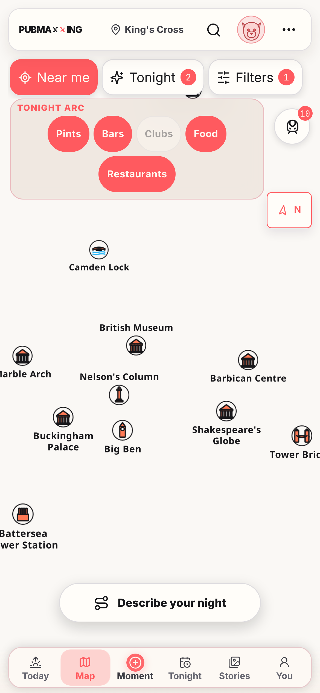
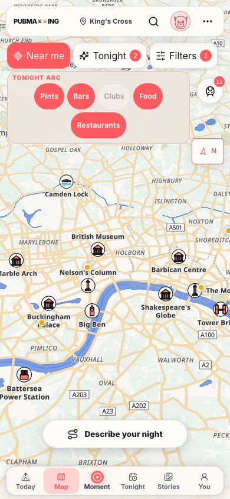
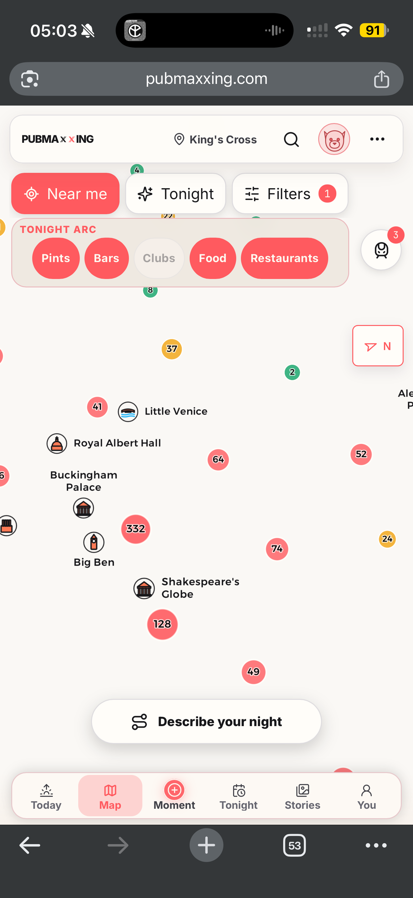

# Blank basemap diagnosis and verification

## Root cause

`public/sw.js` intercepts every GET to `tiles.openfreemap.org` with
stale-while-revalidate. Before this fix, its cache-miss promise combined three
independent operations:

1. Fetch a valid tile.
2. Write the response to Cache Storage.
3. Trim the cache.

If either cache operation rejected, the shared catch converted the successful
network response into `Response.error()`. Cache writes can reject under storage
pressure. The update state made that pressure more likely because the active
worker and waiting worker temporarily kept two versioned shell cache sets.

The browser reproduction used a 390 by 844 mobile viewport:

1. Install and activate the current worker.
2. Warm the map and its OpenFreeMap cache.
3. Navigate to Today and delete only cached vector tiles.
4. Cap origin quota at current usage plus one byte.
5. Register a new worker URL and wait for it to reach `waiting`.
6. Navigate back to Map while the old worker remained controller.

The direct tile request still returned 200 with a non-empty body. Every
browser tile request returned `net::ERR_FAILED`, while own-origin chrome,
landmarks, clusters, and pins remained. The result matched the captain's
screenshot.

The fix separates network delivery from best-effort cache maintenance. A valid
network response now reaches MapLibre even if `cache.put()` or trimming fails.
Opaque responses still pass through and are not cached. A genuine network
failure plus cache miss still returns an error response.

The old worker remains controller during an update, as designed. No service
worker scope or offline capability was removed.

## Silent failure guard

MapLibre can count errored tiles as loaded. The existing readiness timeout
therefore could not detect every blank basemap. The initial tile-error
classifier now treats four concentrated failures before first basemap paint as
systemic. A single initial TileJSON metadata failure is systemic too because it
cannot produce a tile burst. That terminal failure is not discarded while the
tab is hidden or camera is moving because MapLibre emits it only once. Both
spend one bounded style retry, then show:

> Map background couldn't load. Tap Retry to try again.

The Retry action reinitialises the map. A slower successful tile stream also
clears a timeout-owned notice automatically. A notice caused by actual request
errors stays until Retry because MapLibre considers errored tiles settled.

Container-race hypothesis was ruled out in the exact failure: canvas backing
size was 1170 by 2532 for a 390 by 844 CSS viewport, camera and overlay
coordinates were correct, and the map never recovered after 24 seconds.

## Performance

Initial Slow 4G measurement used 390 by 844 at DPR 3, 4x CPU slowdown, 100 ms
latency, 200 KB/s download, and 100 KB/s upload. Three-run median to
`pubmax:pin-reveal`:

| Arrival | Before | After |
| --- | ---: | ---: |
| Cold `/map` | 19.233 s | 24.160 s |
| Today to Map | 11.728 s | 12.699 s |
| Tonight to Map | 13.161 s | 15.149 s |
| Stories to Map | 12.204 s | 18.423 s |
| You to Map | 11.045 s | 13.550 s |

All 15 after samples ended with a real `tiles` reveal, not the 12-second
timeout. The later provider run was slower across every route, so these raw
end-to-end figures do not claim a network win. They report what happened rather
than hiding OpenFreeMap variance.

Resource tracing identified the deferred canvas chunk as the controllable
bottleneck. It was 1,110,563 decoded bytes and did not start on Today until
321.5 ms after the Map tap.

The fix warms that same dynamic module during idle time from primary
navigation. Save-Data, `2g`, and `slow-2g` keep the existing lazy behaviour.
The map remains code-split.

A paired before/after Slow 4G run against production builds measured blocking
time until that 1.11 MB canvas module was ready:

| Arrival | Before | After |
| --- | ---: | ---: |
| Cold `/map` | 10.026 s | 7.864 s |
| Today to Map | 3.435 s | 0 ms |
| Tonight to Map | 3.215 s | 0 ms |
| Stories to Map | 4.411 s | 0 ms |
| You to Map | 4.152 s | 0 ms |

Warm navigation measurements allowed eight seconds on the source page, enough
for the normal-connection idle warmup to finish. OpenFreeMap tile completion
remains the end-to-end constraint. The paired resource trace isolates the
controllable app-owned improvement: a warm in-app tap no longer waits 3.2 to
4.4 seconds for the canvas module. Correctness is separately held by the
quota/update browser regression, which requires a real `tiles` reveal rather
than a timeout.

## Retry usability

At 390 by 844, a deterministic 15-second vector-tile delay reaches the honest
notice, keeps it above phone navigation, and gives Retry a 44px target. Removing
the delay and tapping Retry reconstructs the map and reaches a real tile reveal.

## Screenshots

390px reproduction before:

390px after, under the same quota plus waiting-update state:

Captain's original iPhone screenshot:

## Verification

- `npm test -- __tests__/serviceWorkerCache.test.ts __tests__/mapTileFailure.test.ts __tests__/pinRevealCoordinator.test.ts __tests__/mapWarmup.test.ts`
- `PW_SKIP_WEBSERVER=1 PW_PORT=3218 npx playwright test e2e/map-gl.spec.ts --project=chromium-gl --grep "bounded pin fallback"`
- `PW_SKIP_WEBSERVER=1 PW_PORT=3218 PW_MAP_EVIDENCE=1 npx playwright test e2e/map-service-worker.spec.ts --project=chromium-sw-gl`
- `npm run verify`
