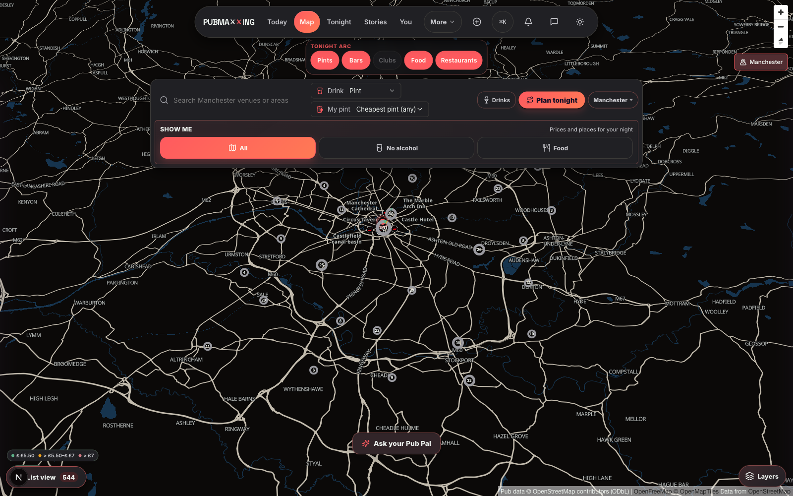
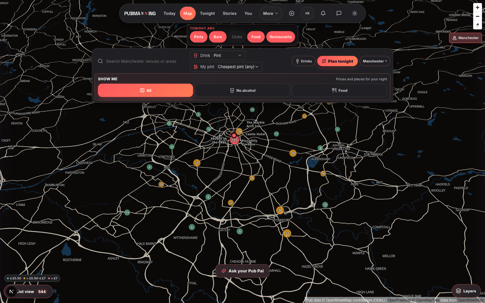
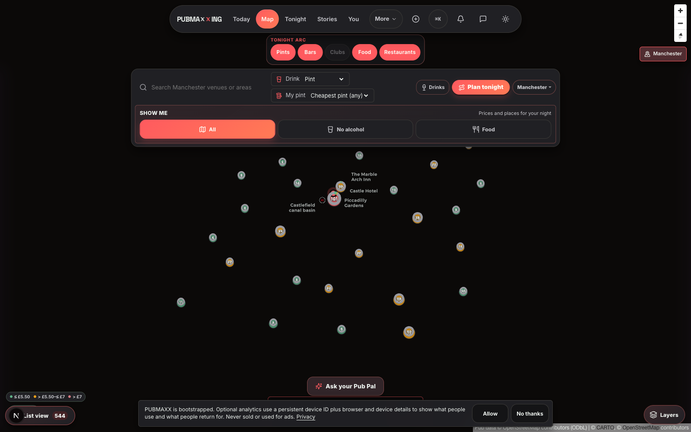

# Desktop Manchester location cluster flicker

## Reproduction

Setup: Chromium at 1600 by 1000, dark theme, no stored location permission,
Manchester coordinates (`53.4808, -2.2426`), and tours suppressed so they could
not cover the map. Geolocation was granted at browser-context level before page
load. After loading `/map/manchester`, the attached location control was clicked
programmatically so banner CSS could not prevent the test from exercising its
exact `checkNearby` and `onLocationFound` path. Returning the settled camera to
the full Manchester view exposed the cluster renderer.

- **Initiating trigger:** Permission grant was not sufficient by itself.
  Position arrival created the location camera transition, but nearby pin zoom
  stayed stable. Flicker started when that journey entered city cluster zoom
  and the first non-empty donut reconciliation hid the legacy MapLibre cluster
  layers. A following render queried a transiently empty source snapshot and
  handed ownership back to those layers, starting the loop.
- **Masking condition:** Desktop fine-pointer rendering at cluster zoom exposed
  it. Nearby individual-pin zoom hid it. Disabling only the decorative DOM
  donut renderer through its existing coarse-pointer condition also hid it.
  A selected venue, tours, and ongoing camera motion were not required once the
  loop started. Manchester reproduced it consistently outside London.
- **Visible symptom:** Numbered cluster symbols alternated between grey
  MapLibre circle/count layers and price-band DOM donut markers. Marker
  positions and counts stayed aligned. Basemap remained stable beneath them.

The pre-fix browser regression sampled marker count every 75 ms after the
Manchester camera settled. It repeatedly alternated between 29 and 0:

```text
29,0,0,29,29,29,0,0,0,0,29,29,0,0,0,29,29,0,0,0,29,29,29,0,0,29,29,29,0,0
```

## Before

These frames were captured 300 ms apart from the same settled camera. Grey GL
clusters in the first frame become coloured DOM donuts in the second without
any camera movement.

| MapLibre cluster layers | DOM donut markers |
| --- | --- |
|  |  |

## Cause and historical comparison

`createDonutClusterSync` listened to `render`, qualifying `sourcedata`, and
`moveend`, but treated an empty `querySourceFeatures` result from every event as
authoritative. MapLibre 6 returns transient empty snapshots during render and
source reconciliation. Each empty result removed every DOM marker and restored
the GL layers. The next non-empty result recreated every marker and hid the GL
layers. Those visibility changes scheduled more renders, making the swap
self-sustaining.

The flicker does **not** predate the MapLibre 6 upgrade:

- At `7fbe9d46`, before accessible in-view venue navigation but after MapLibre
  6, 40 samples alternated between 29 and 0 DOM markers. Half the samples were
  empty. The accessible-list recompute is not the feedback loop.
- At `21bfa9e5`, immediately before `cfed5e58`, the locked MapLibre 5.24.0 build
  stayed on its GL cluster renderer for all 40 samples. No DOM/GL alternation
  occurred. The unsafe empty-result assumption already existed in application
  code, but MapLibre 6 exposed it.
- `ba4b4e71` removed ambient rotation. Captured camera and basemap pixels stayed
  fixed during the symbol swap, so camera animation was not driving it.
- The deterministic Manchester load bypassed `7fbe9d46`'s Plan and Near entry
  controls and still reproduced the loop.

## Counterfactual and falsifier

Smallest counterfactual: make the existing desktop donut enhancement ineligible
while leaving clustering, density, camera, data, and MapLibre unchanged. The
existing coarse-pointer branch did exactly that. DOM donut count stayed at
zero, no large symbol-layer pixel transitions occurred, and stable GL clusters
remained.

Falsifying observation: cluster symbols would keep alternating while no donut
markers existed, or visible flicker would continue while donut marker count
never reached zero. Neither occurred in the counterfactual or after the fix.

## Fix and after evidence

Render and source-data queries may now update active donuts from non-empty
snapshots, but cannot deactivate them from a transient empty snapshot. A
completed `pubs` source revision and a settled `moveend` remain authoritative,
so a genuinely empty result still clears stale markers and restores the GL
layers. Crossing the existing cluster zoom boundary still deactivates
immediately. Density, clustering, and collision contracts are unchanged.

After the fix, 40 samples taken 100 ms apart all retained the same 29 DOM
markers. That time series, rather than a single still frame, is the evidence
that alternation stopped. The Playwright journey and focused unit regression
cover both sides: transient render emptiness retains markers, while a completed
empty `pubs` source revision clears them.

These loaded-basemap frames are 1.5 seconds apart at the same settled desktop
Manchester viewport after granted location. Cluster symbols remain in the same
renderer state and positions.

| Stable after frame A | Stable after frame B |
| --- | --- |
|  |  |

For comparison, MapLibre 5.24.0 remained stable on the legacy renderer:



## Missing location control

The missing control is a separate defect. Across eight fresh desktop contexts
with no prior permission, its DOM appeared in all eight after hydration. The
control paint rate was 1 in 8 by 7.75 seconds. In the other seven,
`mapBannerStaging.css` hid `CitySuggestBanner` because an asynchronously loaded
`cityStatusBanner` has higher presentation priority. This is banner staging,
not MapLibre source reconciliation. The deterministic pre-fix journey clicked
the attached control through the DOM whether or not CSS painted it, and the
renderer loop then persisted independently at cluster zoom. Correlation with
the flicker was not measured because the full journey did not run in every
context. Treat the 7-of-8 control defect as separate work.

## Design craft observation

Before frames also preserve the separate hierarchy finding: the near-white road
network draws at full weight and dominates the view while product clusters read
as faint circles behind it. This fix deliberately does not alter basemap,
cluster density, colour, or collision policy.
