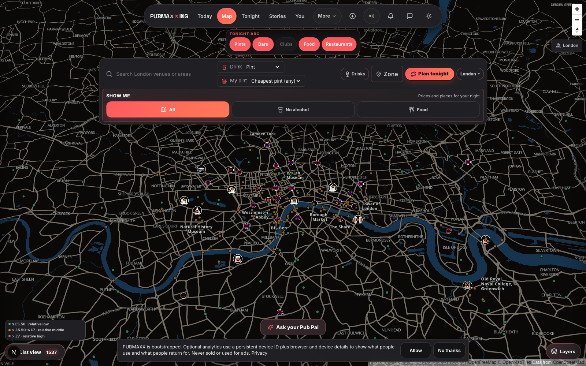
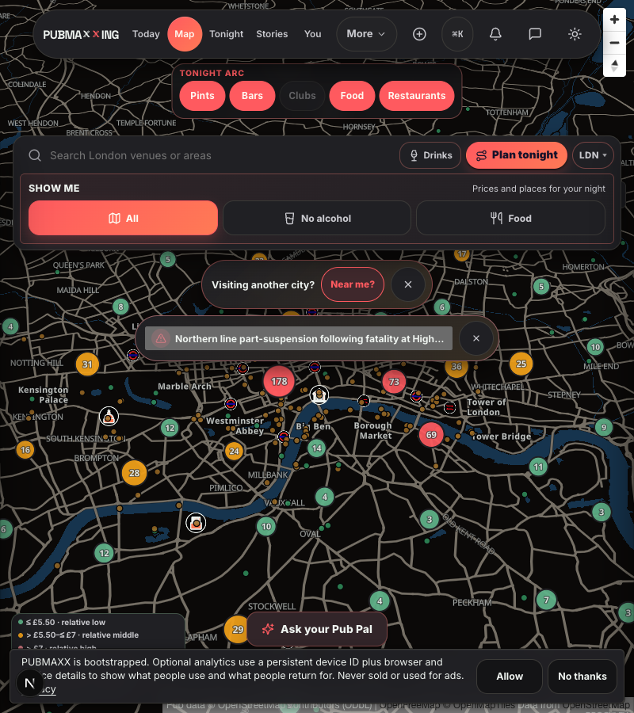
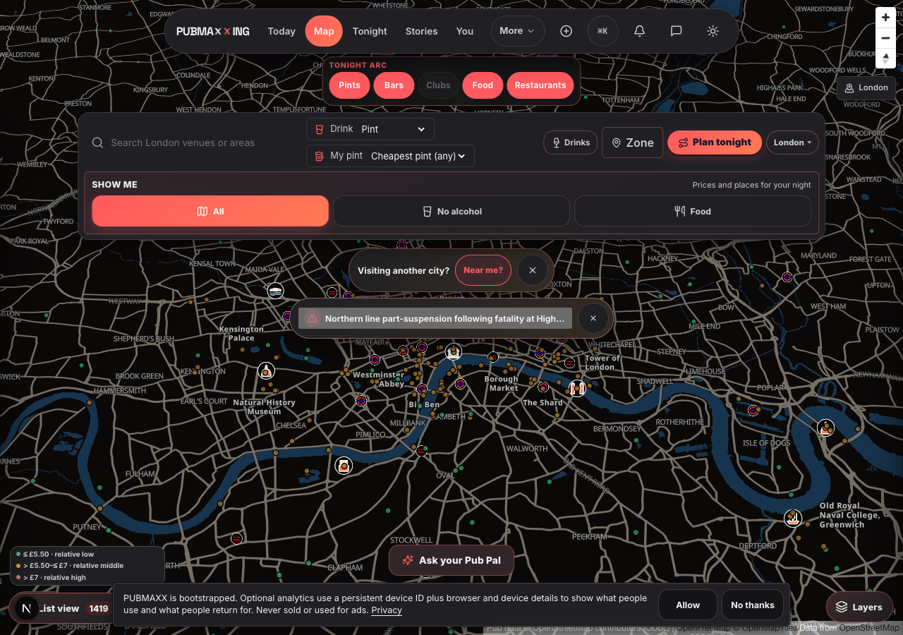

# Desktop Near me control

## Result

Fresh desktop location control went from 0 of 50 painted after city status
arrival to 50 of 50 visible and actionable at 10 seconds. Exact final layout
then passed another 20 of 20 runs with city status present and an 8px gap
between banners.

Geolocation permission stayed `prompt` in every measured run. No run clicked
the control or granted permission before measurement.

## Reproduction method

Chromium ran against `npm run dev` with one browser process. Before each
navigation, local storage, session storage, and cookies were cleared. Each run
opened a cache-busted `/map` URL at a fixed desktop viewport.

The probe recorded:

- whether `button.citySuggestBannerSwitch` existed;
- geolocation permission state;
- computed display, visibility, opacity, and bounding box;
- whether city status had mounted;
- whether the control centre was inside the viewport;
- whether `document.elementFromPoint` at the control centre returned the
  control itself.

That last check matters. CSS visibility alone produced a false positive while
the toolbar covered the control.

## Before

The first 50-run matrix sampled once actionable city status had mounted, with
an eight-second status deadline:

| Viewport | Attached | Painted | Permission |
| --- | ---: | ---: | --- |
| 800x800 | 10/10 | 0/10 | `prompt` 10/10 |
| 1024x800 | 10/10 | 0/10 | `prompt` 10/10 |
| 1280x800 | 10/10 | 0/10 | `prompt` 10/10 |
| 1600x1000 | 20/20 | 0/20 | `prompt` 20/20 |
| **Total** | **50/50** | **0/50** | **`prompt` 50/50** |

The earlier pin-flicker lane recorded 1 of 8 by 7.75 seconds. Current
measurement got an actionable status response in all 50 runs, so its masking
window did not occur. Both observations fit the same trigger: when status is
absent or late, location can remain temporarily visible; when status arrives,
staging hides it.

## Diagnosis

### Trigger

Fresh `/map` load hydrates and attaches `CitySuggestBanner`. An asynchronous
`/api/citymcp/status` response with an actionable disruption then mounts
`.cityStatusBanner`.

### Masking condition

Status absence or delay masks the staging failure. Before status mounts, the
location banner can briefly draw. Status presence, viewport width, and the
closed toolbar shape determine the settled result.

The following did not explain the rate:

- geolocation permission, which remained `prompt`;
- first-run tour, which fresh storage suppressed by leaving analytics consent
  undecided; that matrix did not exercise consent-decided, tour-unseen state;
- fonts, which were loaded in the reversible probe;
- viewport width, because every tested desktop width failed;
- React conditional rendering, because the button remained attached.

### Symptom

Control was present in the document, not unmounted.

Once status mounted, this selector gave its ancestor `display: none`:

```css
.mapStage:has(.cityStatusBanner) .citySuggestBanner
```

Button bounding box became zero. Removing only status made the box non-zero,
and restoring status hid it again.

That first counterfactual was not sufficient. Visual review and a Playwright
trial click found the control underneath the expanded map toolbar. The No
alcohol option intercepted pointer events. So there were two independent
masks:

1. status staging removed the location banner from layout;
2. stale `+60px` placement assumed an old single-row toolbar and put any
   otherwise-visible control behind the current toolbar.



## Counterfactual and falsifier

Smallest sufficient condition: while city status exists, location stays in
layout and its centre is the top hit-test target in a slot after the closed
toolbar.

Two narrow CSS changes enforce that one condition:

1. status no longer suppresses `.citySuggestBanner`;
2. location uses the measured closed-toolbar height plus a 12px gap.

Either half alone is insufficient. The selector-only screenshot above is the
observation that falsified the initial banner-staging-only explanation.

The final explanation would be wrong if any settled run had status present and
either:

- location ancestor returned `display: none`;
- location centre hit the toolbar or another element;
- location left the viewport;
- status overlapped location.

No such observation occurred in the post-fix matrices. Playwright regression
coverage also performs a real trial click, so a future occluder fails even when
computed CSS says visible.

## Fix

- `mapBannerStaging.css` keeps location independent of status while both
  continue to defer the lower Tonight card.
- Shared prompt eligibility reserves the desktop Map prompt moment for location,
  so curated onboarding, the tour, consent, and other budgeted prompts stand
  down until location is unavailable or dismissed.
- `mapToolbar.css` publishes the closed desktop toolbar height: 145px from
  641 through 900, and 181px above 900.
- `citySuggestBanner.css` places location 12px below that block.
- `cityStatusBanner.css` places status 8px below location and keeps its detail
  sheet on the same anchor and inside the remaining viewport height.
- `e2e/map-near-me.spec.ts` supplies deterministic severe city status with
  separate fresh browser contexts at 800 and 1600, forces empty and degraded
  Tonight results, sets consent-decided and tour-unseen state, then checks
  attachment, accessible name, trial-click actionability, absence of prompt
  overlays, permission `prompt`, 44px height, viewport bounds, banner separation,
  and the expanded status-sheet viewport budget.

No copy, map density, clustering, collision, pin renderer, venue-list keyboard
path, drawer focus, or call-to-action colour changed.

## After

The 50-run actionability matrix used the final location staging and placement
at a fixed 10 seconds:

| Viewport | Actionable | Permission | Centre hit |
| --- | ---: | --- | --- |
| 800x900 | 10/10 | `prompt` 10/10 | control 10/10 |
| 1024x900 | 10/10 | `prompt` 10/10 | control 10/10 |
| 1280x900 | 10/10 | `prompt` 10/10 | control 10/10 |
| 1600x1000 | 20/20 | `prompt` 20/20 | control 20/20 |
| **Total** | **50/50** | **`prompt` 50/50** | **control 50/50** |

Visual QA then moved only city status farther away from the already-actionable
control. Exact final layout ran another 20 times:

| Viewport | Actionable | 8px status gap |
| --- | ---: | ---: |
| 800x900 | 10/10 | 10/10 |
| 1600x1000 | 10/10 | 10/10 |
| **Total** | **20/20** | **20/20** |

Later onboarding-eligibility and CitySuggest state transitions were not part of
this measured matrix. Regression coverage exercises those states separately.

| 800px final | 1280px final |
| --- | --- |
|  |  |

## Pin flicker relationship

Not measured. This work establishes neither correlation nor independence from
pin flicker. Pin renderer, cluster ownership, density, and collision policy
were untouched.
