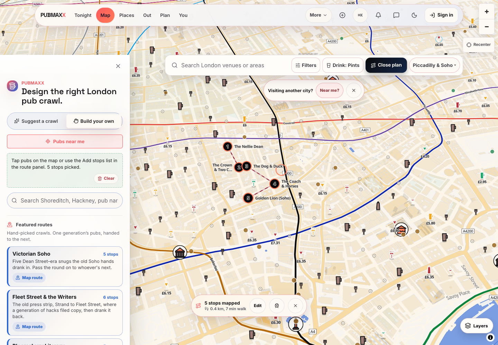
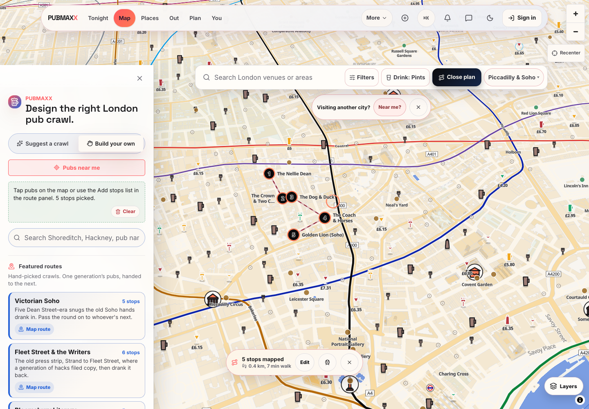

# Page loading performance proof

This record compares production builds on 7 October 2026. The baseline is `0eb292b6b8e0cf0a6d341986fe584a04f49fcae6`. The measured application head is `e47b8196761e5fcac9211e2e18bf490d4bdc8cdd`.

The baseline served on private port 34731. The changed build served on private port 34732. Both builds used the same committed datasets and keyless browser-test environment. Neither build used production credentials. The changed build passed compilation, type checking and static generation.

## Changes

Desktop primary navigation and the Day/Tonight switch now use the existing intent link. Hover or keyboard focus prepares the selected destination before a click. The current page does not start this preparation again.

The map and route panel share a pending POI read for the same path in the browser. The entry clears after success or failure. A later read still fetches fresh data. Server calls do not share this browser state.

Map intent preparation now uses the deployment revision keys consumed by the venue loaders. London manifest/core files and city monoliths use the matching keys. Local revision and overlay keys retain their existing behavior.

## Map navigation

The experiment starts on Tonight, waits for the page to settle, hovers its desktop Map link for 800 milliseconds, and clicks it. Timing ends when the rendered map exposes at least one actual tappable marker. This marker can be a cluster. A data-ready mark alone does not satisfy the experiment.

Chrome 154.0.8037.93 used SwiftShader, a 1440 by 900 viewport, four-times CPU throttling and cold browser contexts. Network conditions were 150 milliseconds latency, 200000 bytes per second download and 93750 bytes per second upload. Neither arm intercepted responses or added a synthetic request delay.

| Click to first tappable marker | Before | After |
| --- | --- | --- |
| Sample 1 | 8214 ms | 7913 ms |
| Sample 2 | 7747 ms | 7517 ms |
| Sample 3 | 7869 ms | 7278 ms |
| Median | 7869 ms | 7517 ms |

The median improved by 352 milliseconds, about 4.5 percent. The ranges overlap. Three local samples cannot establish a production latency guarantee. Before, no venue/map preparation requests started during hover. After, such requests started before the click in all three samples.

Raw captures are [before](map-navigation-before.json) and [after](map-navigation-after.json).

## Day to Tonight

Both arms delayed Tonight RSC requests by **350 milliseconds**. The experiment hovered Tonight for 800 milliseconds before clicking. It measured the click until Tonight became the current page, across five fresh mobile browser contexts.

The median changed from 414 to 44 milliseconds. Before, every destination request started after the click. After, destination requests started before the click. These figures demonstrate intent preparation under a controlled delay. They are not production measurements.

Raw captures are [before](switch-before.json) and [after](switch-after.json). The production browser regression suite passed both the Day/Tonight and desktop Tonight/Map cases on the measured application head.

## Overlapping POI downloads

The browser opened the real Victorian Soho crawl and selected Plan an outing. It required a visible route panel and actual painted map markers. Both arms served the same 97488-byte committed POI dataset with a **7500-millisecond delay** to reproduce overlapping consumers.

All three baseline samples downloaded that body twice. All three changed samples downloaded it once. The probe waited for completed resource timing entries rather than treating response fulfilment as a finished browser download. Every captured body had the expected size. The route panel remained visible in every sample.

A separate 2500-millisecond baseline run produced sequential reads. Sharing pending requests cannot remove sequential reads, and the change deliberately preserves their freshness. Ordinary direct map loading already made one POI read. This experiment therefore supports a reduction in overlapping work, not a direct cold-map first-pin improvement.

Raw captures are [before](crawl-before.json) and [after](crawl-after.json). The public data-helper regression also verifies one parse for shared reads, unchanged records, retries after failure and independent paths.

## Deployment keys and the current page

The public warmup-to-venue-loader regression replays the committed data through a simulated URL-keyed HTTP cache. The baseline foreground London loader made two additional cache misses after intent preparation. The changed loader made zero and retained all 148 core venues. The Manchester loader also reused its prepared monolith key. These are executable public-helper checks. Local production builds use the local revision, so this is not deployed-preview evidence for a nonlocal revision.

A separate browser check held MapLibre worker assets before any marker could paint. Focusing the current Map link previously started POI and transit reads. The changed build started neither read during the one-second focus window. Existing foreground manifest/cell reads could still arrive. The guard skips the exact path and query before scheduling canvas work or changing the intent history. Other queries and destinations remain eligible.

Raw captures are [before](current-map-before.json) and [after](current-map-after.json). The baseline for this isolated guard check is the preceding application head `6ea21fbcc`, because it reproduces the current-link behavior after desktop intent links were added.

## Limits

The measurements use local production servers and controlled browser conditions. Other fleet processes can affect local CPU scheduling. The experiments do not prove production Core Web Vitals or change route budgets. No production deployment or database migration occurred. The desktop More menu and files owned by other open pull requests were kept outside this work.

## Cold arrivals across the main pages

Each arm used three cold browser contexts per route. The server and production build were warm. Chrome used SwiftShader, a 390 by 844 viewport, four-times CPU throttling and Fast 4G conditions. The network had 75 milliseconds latency, 1012500 bytes per second download and 168750 bytes per second upload.

Readiness required the load event, the budgeted visible selector, and the hidden skeleton condition where defined. The map also required actual painted markers. This measure is broader than content paint and does not isolate first-pin latency. Both arms allowed external requests and waited another 1500 milliseconds before reading resource and paint observations.

| Route | Before median ready | After median ready | Before range | After range |
| --- | --- | --- | --- | --- |
| `/` | 1218 ms | 1117 ms | 1114-1357 ms | 1077-1268 ms |
| `/map` | 3528 ms | 3413 ms | 3513-3945 ms | 3288-3512 ms |
| `/today` | 1134 ms | 1109 ms | 1115-1209 ms | 1105-1193 ms |
| `/tonight` | 1233 ms | 1181 ms | 1215-1237 ms | 1178-1238 ms |
| `/places` | 1088 ms | 1124 ms | 1082-1091 ms | 1104-1129 ms |
| `/out` | 1070 ms | 1072 ms | 1064-1081 ms | 1069-1084 ms |
| `/plan` | 1093 ms | 1100 ms | 1092-1104 ms | 1095-1101 ms |
| `/pal` | 1012 ms | 1009 ms | 1007-1027 ms | 1004-1028 ms |

All 48 sampled arrivals returned HTTP 200 and met their readiness conditions. The results do not show a uniform cold-arrival improvement. The shared changes target navigation intent and overlapping requests. The home page had a missing first-sample LCP observation in the baseline, so this run cannot establish its LCP median. This comparison is not the formal route-budget or Core Web Vitals sweep.

The initial read-only inventory visited all 45 budgeted paths and received HTTP 200 without navigation errors. That single-sample inventory checked navigation and the page shell only. It did not prove usable content on every route.

Compact captures are [before](cold-loads-before.json) and [after](cold-loads-after.json).
