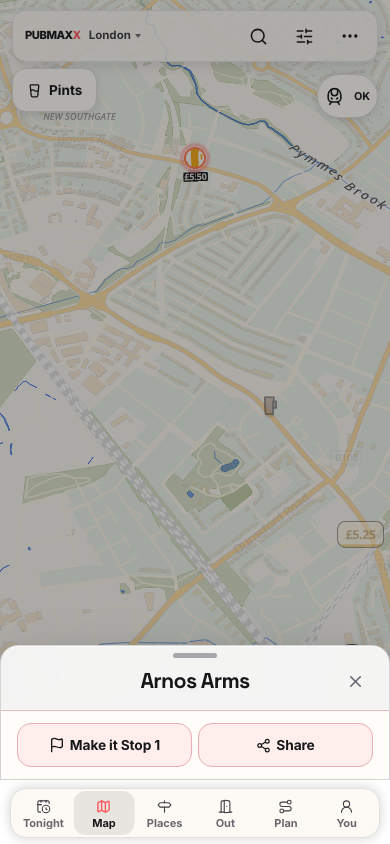
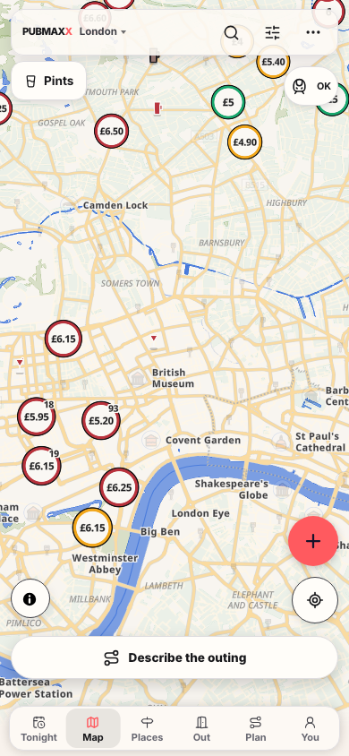

# Phone venue-sheet dismissal

Source fix: `a2033c35f5c9d86c94f4e192c15f4459fdafb2d7`. The unchanged `e2e/map-surface-history.spec.ts:328` now closes the venue portal after the same downward drag and returns to Map.

The branch had replaced the viewport-relative peek with the measured header and command bar. At 390×844, a 135px peek moved the physical dismissal line from 92.84px to 67.5px. The established gesture releases at about 68.84px, so the old build snapped back to peek.

The hook now captures the viewport height at grab. The resolver uses half of the viewport-relative peek for physical dismissal. Measured chrome still controls the presented snap heights. The body remains hidden at resting venue peek, and smaller half-to-peek flicks keep their recovery point.

## Browser proof

Both images use the unchanged spec at 390×844 in Chromium 153.0.8010.12, Playwright revision 1243, against private-port production builds. The before image uses the preserved production build of `f41d62ea2cabfb0c97d6a68a46e7d16be8409564`. It was captured after implementation by rerunning that build, whose source still has the faulty threshold. The initial three failing baseline runs occurred before the source fix. The after image uses the source-fixed build later committed as `a2033c35f`.

Before: the venue portal remains open after the drag.

After: the portal closes, the URL returns to `/map`, and the Map controls remain reachable.

| Check | Result |
| --- | --- |
| Unchanged fling spec before fix, three runs without retries | 0 passed, 3 failed with portal count 1 |
| Unchanged fling spec after fix, three runs without retries | 3 passed, 0 failed |
| Map history, keyboard, shared-sheet and bottom-navigation regressions | 28 passed, 0 failed |
| Sheet resolver and viewport-shrink unit tests | 52 passed |

Two added behavioral unit tests failed before implementation. They cover a shorter command-bar peek and a taller command bar on a shorter viewport. [Structured results](fling-dismiss-results.json) record the browser checks. Full local command logs remain in `artifacts/fling-regression-before.log`, `artifacts/fling-source-fix-three.log`, and `artifacts/fling-source-fix-regressions.log`. The screenshot-only reruns also confirmed one expected baseline failure and one corrected pass.

The full local `npm run verify:no-mistakes` gate passed on source commit `a2033c35f`: 21,441 unit tests passed with one existing skip, and 564 PostgreSQL tests passed. Lint, type checking, dead-code checking, data validation, and the remaining gate commands passed. Review scope reported no forbidden files or CI churn. The full log is `artifacts/third-full-verify.log`. Browser downloads were moved outside this copy before the successful run, without changing lint or dead-code rules.

These are browser results at a phone viewport. They do not prove a native Android or iOS fling, a physical-device gesture, or the deferred ultra-short viewport sizing case. Earlier native lane records remain in [system-chrome.md](system-chrome.md) and [keyboard-overlays.md](keyboard-overlays.md).

## Validation ownership

This replacement branch excludes the test-only CI edits from the superseded branches. The fling spec is unchanged from main. `auto_fix.ci: 0` requires a gate before CI repairs, so a CI failure receives an explicit source-fix instruction. No assertion or review-scope policy was weakened.
