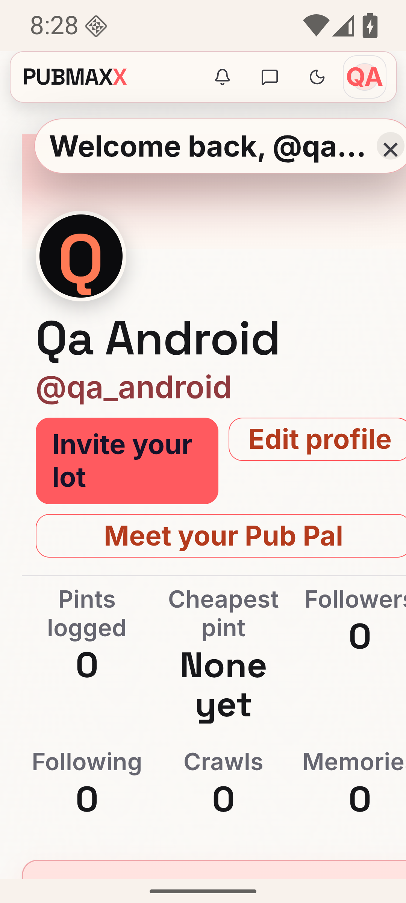
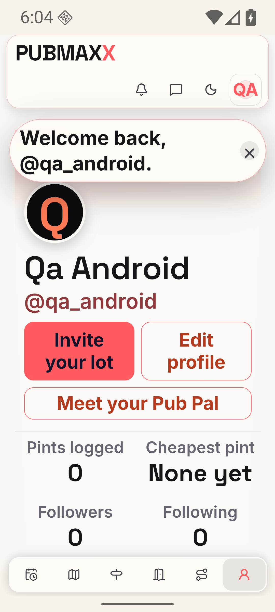
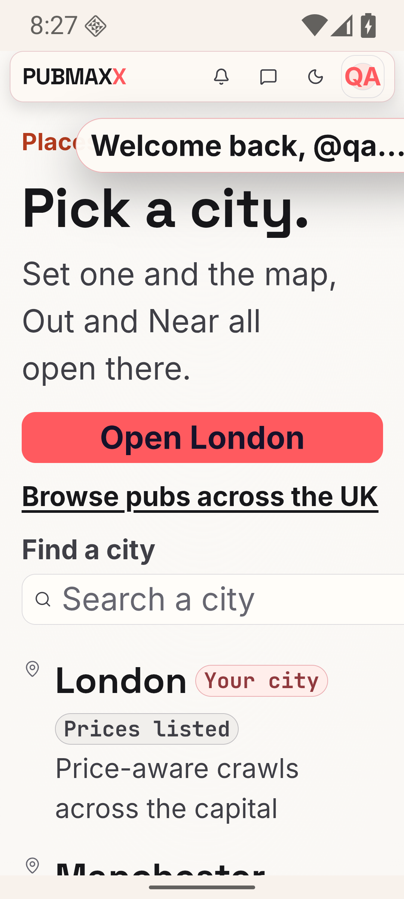
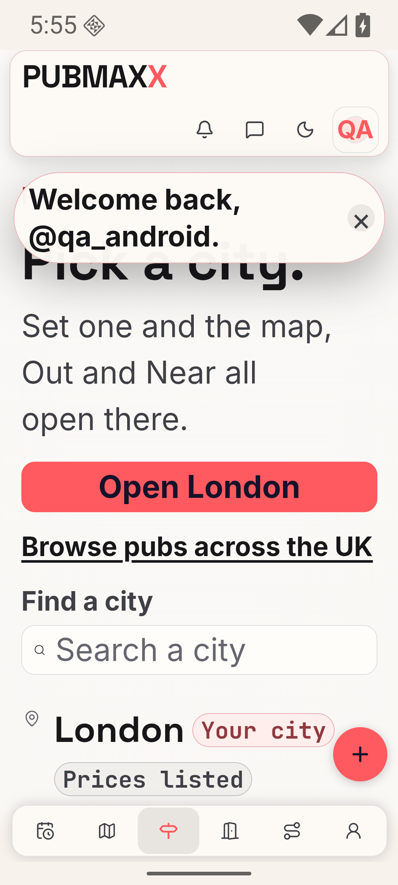
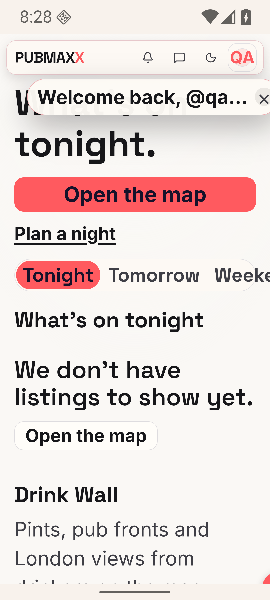
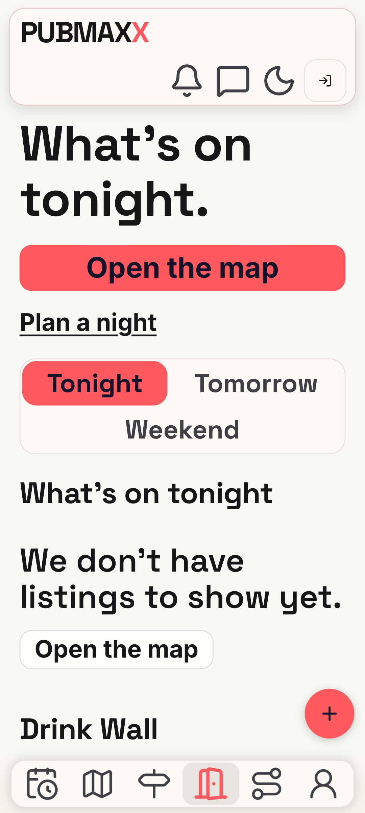
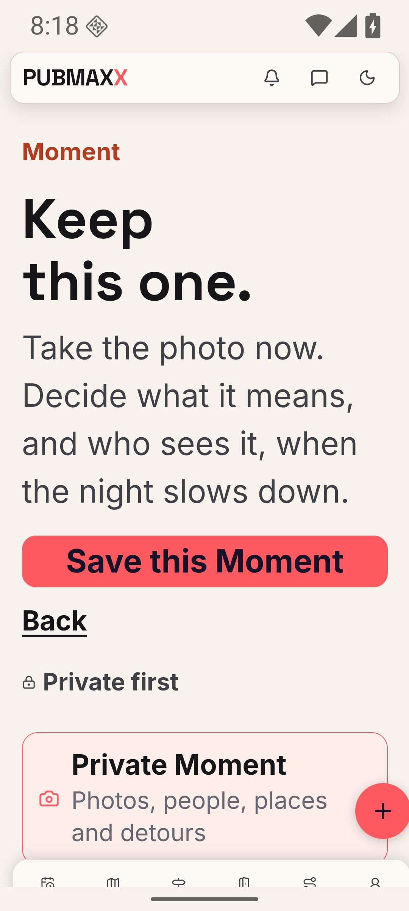
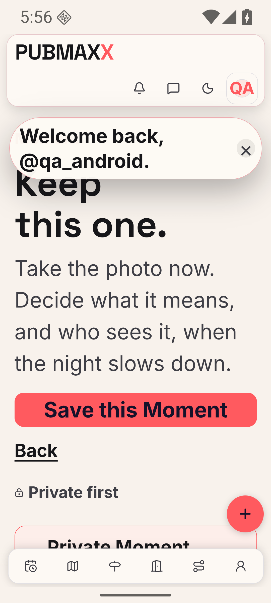
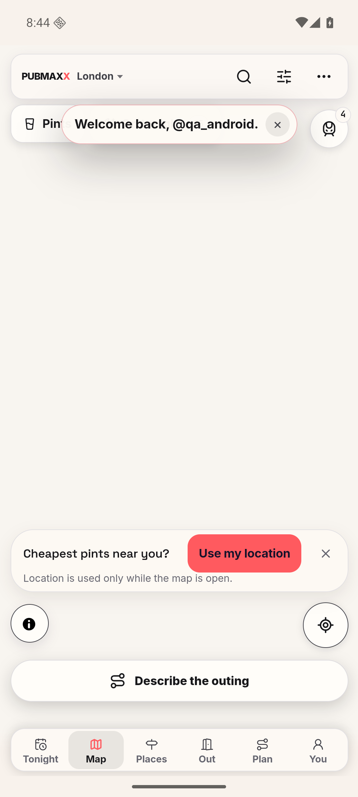
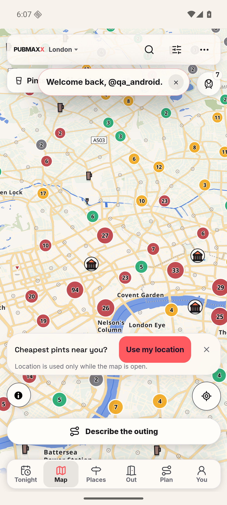

# Android large text

This records lane 4 findings A04, A22, and A26 on 7 October 2026.
The baseline is the production build of `origin/main` at `3bc62e232`.
The rig uses an API 36 emulator, WebView 133, and a 412 CSS-pixel phone viewport.
The app loads a local production server through `localhost:3915` and a private ADB reverse.
The profile uses a synthetic owner session. No production account was used.
The native sweep bypasses the service worker because the baseline local rig rejects revision-mismatched venue shards.

## Layout results

The native sweep asserts the route, viewport width, document width, and root font size after each navigation.
All 30 route and scale combinations passed. Their measurements are in [native-matrix.json](native-matrix.json).
The root font sizes are 20.8px, 24px, and 32px at scales 1.3, 1.5, and 2.0.
Every result retains `innerWidth = 412` and `scrollWidth = 412`.

The routes are `/tonight`, `/places`, `/out`, `/plan`, `/u/qa_android`, `/map`, `/near`, `/wall`, `/pal/chat`, and `/moment`.

| Route at 2.0 | Before | After | Cause and change |
| --- | --- | --- | --- |
| Owner profile | 588px | 412px | Action minimum widths and content-sized grids now fit the available width. Stats and profile tabs adapt to large text. |
| Places | 538px | 412px | The search grid now permits its input to shrink. |
| Out | 466px | 412px | At large text sizes the day chips wrap onto new rows. Each day name stays whole. The frame and chips share one corner radius on one row or several. |
| Moment | 425px | 412px | The photo-picker grid shrinks. Each guidance line wraps as a balanced block, and a no-break space keeps "4 MB" together. The picker type is set in rem, so it follows the text size. |

| Before | After |
| --- | --- |
|  |  |
|  |  |
|  |  |
|  |  |

The Out after shot and the [Moment picker after shot](moment-picker-after.png) come from the review round.
No Android emulator was available for that round, so both are Chromium captures with the Android native-shell stub at 412px and scale 2.0.
Each capture sets the root font size to 200% and `data-text-scale="large"` after the page loads. No page style was changed by hand.

## Controls and type

Native controls use the shared 48px height. Header icons, map header tracks, checkbox labels, and tab items follow that token.
The header uses two rows at large text sizes. Its icons and tab icons scale with the text.
The welcome message wraps instead of truncating the handle.
In the native shells, micro-labels use the 0.75rem `--text-2xs` value, which is 12px at the default text size. The web keeps 0.68rem.

The native readability sweep covers Map, Pubs, Discover's canonical Social route, and Pint Index at scale 1.0.
All four have no visible text below 11px. [native-readable.json](native-readable.json) records the before and after measurements.
Map count badges grew from 9.92px and 10.24px to 12px.
Onboarding readability has browser proof with its required first-run handoff. Direct native navigation redirected, so it provides no onboarding proof.

| Before | After |
| --- | --- |
|  |  |

The [profile at scale 1.5](profile-1.5-after.png) also shows equal action heights when one label wraps.

`e2e/mobile-large-text.spec.ts` checks 30 route and scale combinations, three word-integrity cases, six owner-profile layouts, touch targets, and five small-text routes.
The word-integrity cases check that each day chip and the photo-size figure stay on one line at scales 1.3, 1.5, and 2.0.
At scale 2.0 the case also requires the photo-size hint to wrap, so the figure check runs on a real wrapped line.
The touch test checks all ten visible header and tab controls and both checkbox label targets.
It opens Filters and toggles Saved only through the rendered controls.

The iOS owner-profile checks use a Chromium native-shell stub at 390px with text scales 1.3, 1.5, and 2.0.
They verify shared CSS geometry. They do not establish physical iPhone Dynamic Type behaviour.

## Verification

The final production build passed.
Browser checks passed 30 overflow cases, six owner-profile layouts, one touch-target case, and five readability cases.
The readability cases include Discover's redirect and onboarding's required handoff.
After the review fixes, all 45 cases in the spec passed again against a fresh production build.
`npm run verify:no-mistakes` passed. It runs the repository's full `npm run verify` against committed data.
The unit suite passed 20,997 tests, with one existing skip. The database suites passed 554 tests and 10 cleanup tests.
Lint reported no errors. Types, coverage, conditional-skip checks, freshness, install-script policy, and dependency audit passed.

## Reproduction

Run the browser assertions with the repository's production Playwright server:

```sh
PW_PORT=3915 PW_NEXT_DIST_DIR=.next-large-text-check PW_SKIP_KEYLESS_WEBSERVER=1 \
  npm run test:e2e -- e2e/mobile-large-text.spec.ts --project=chromium --workers=1
```

For native proof, set `font_scale` through the rig's private ADB server and restart the app at each scale.
Navigate each route through the WebView debugger, wait for fonts and map chrome, then read the geometry and capture a device screenshot.
Restore font scale 1.0 after the sweep.
