# Consent layout proof, 8 October 2026

The first paint has no consent card. After a qualifying answer, the fixed card clears the landing primary, first Tonight pub, Places city and Social content. Allow and No thanks keep their existing copy and meaning.

The named Social flake already has an anchor-polling fix in commit `0c442d44bf97ec14bd240f7b41ef68437cf9627a`, merged through https://github.com/Singularityszn/pubmax/pull/2042. Its commit message records the original cold-anchor failure. The old assertion passed ten fresh local replays. This repair addresses separately reproduced overlaps and a test fixture that erased the stored consent decision on each document navigation.

The production base is `d69cd6083e8d81d57d56075e35a431efb804a026`. The tested bundle includes this branch's local presentation changes. It is not a byte-identical main build. The ignored task directory retains the full source diff, browser traces, original failures and zero-retry output.

## Before and after

The Places first city moved from y=439.58..513.02 to y=311.58..385.02 at 320x568. The landing primary moved from y=451.66..503.66 to y=391.33..443.33. The accepted consent lane remains y=448..504.

| 320x568 | Before | After |
| --- | --- | --- |
| Landing | 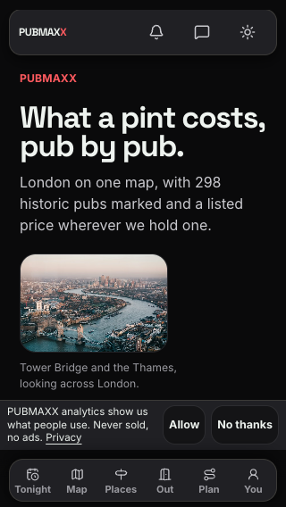 | 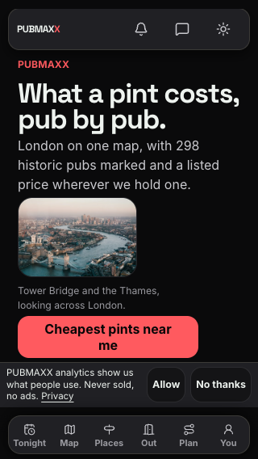 |
| Places | 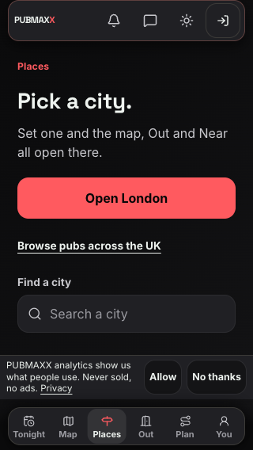 | 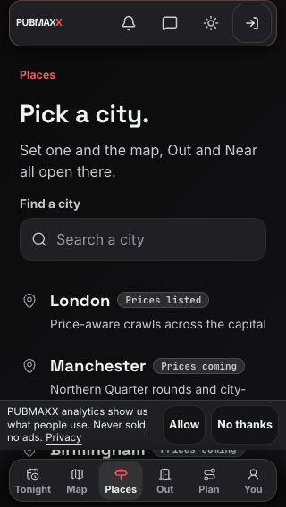 |

Tonight's first pub now precedes the listing explanation and weather. Its name, area and map action remain visible. Its existing explanation, source link and checked date live in a native disclosure. Every visible pub and the existing additional-pubs threshold remain unchanged. The weather information and listing copy remain available below the first answer. The DOM order and desktop grid order agree.

| Tonight viewport and theme | Before | After |
| --- | --- | --- |
| 320x568 light | 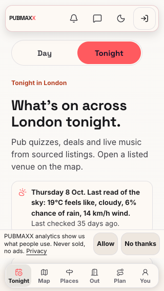 | 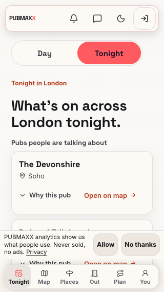 |
| 320x568 dark | 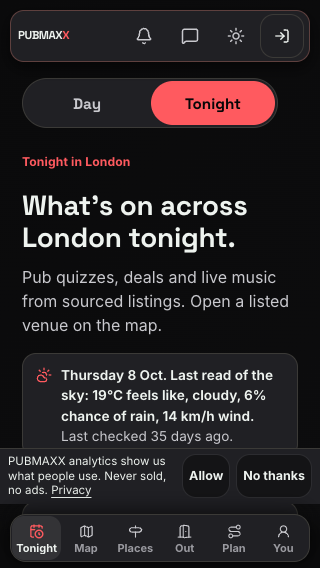 | 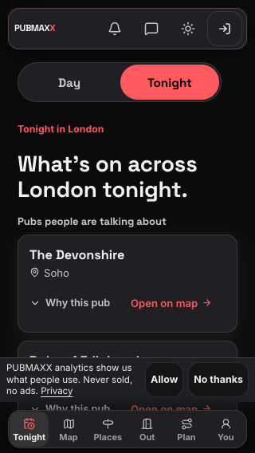 |
| 360x640 light | 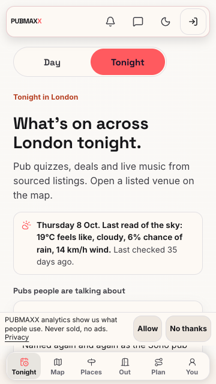 | 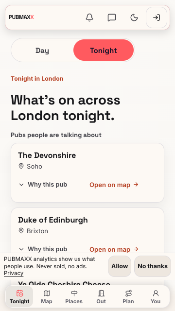 |
| 360x640 dark | 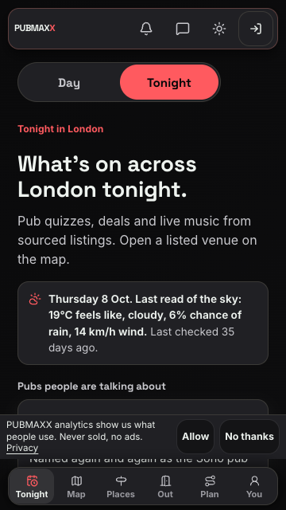 | 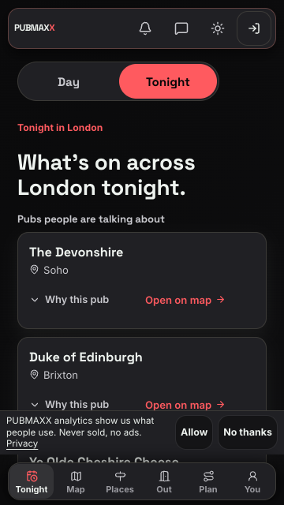 |
| 1440x900 light | 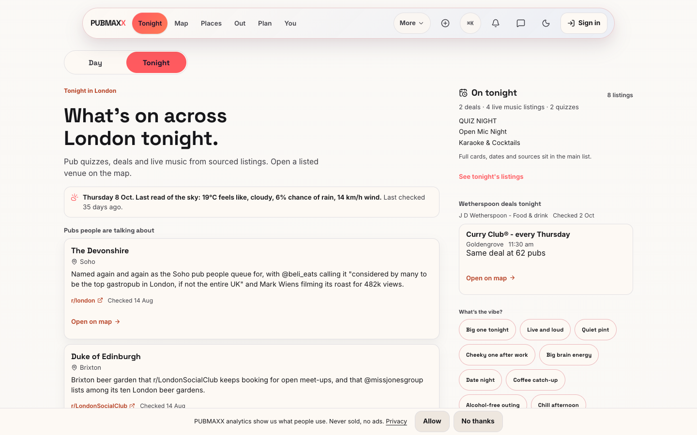 | 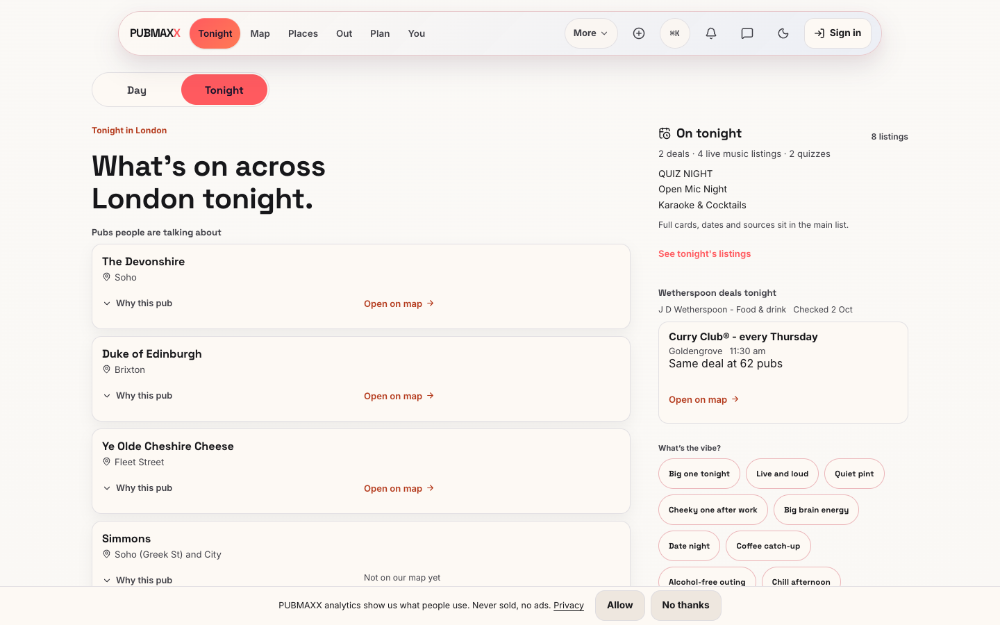 |
| 1440x900 dark | 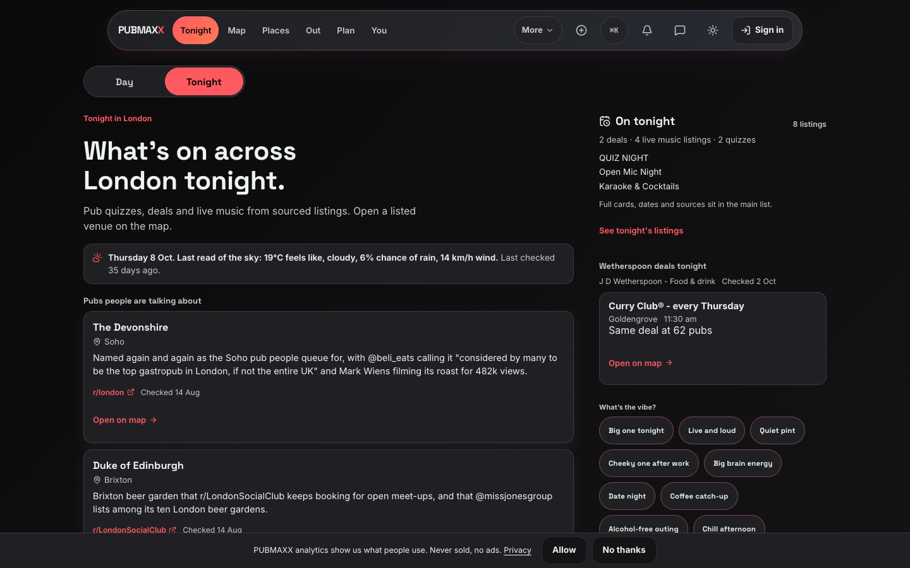 | 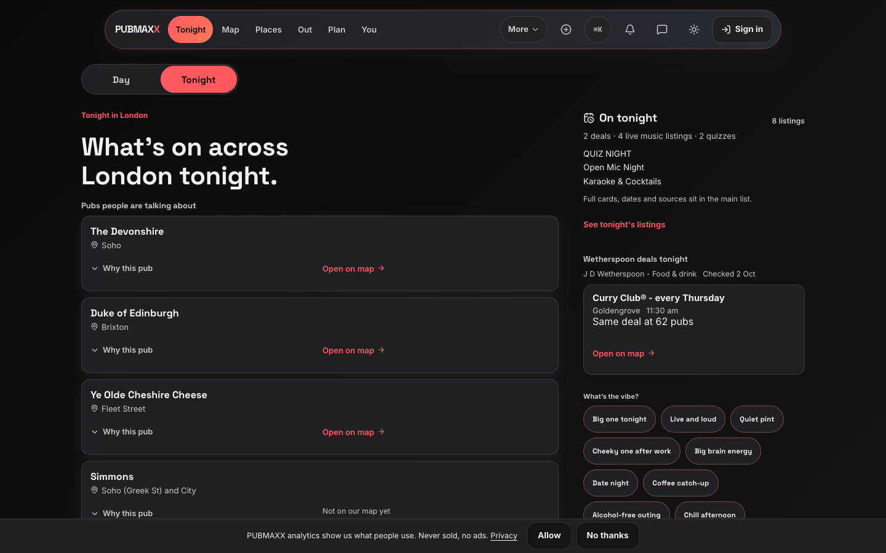 |

The first Tonight row moved from y=501.31..814.44 to y=293.75..416.75 at 320x568. At 360x640 it moved from y=501.31..793.56 to the same y=293.75..416.75. The source and map actions retain their 44px tap floor. The explanation and attribution remain readable when opened:

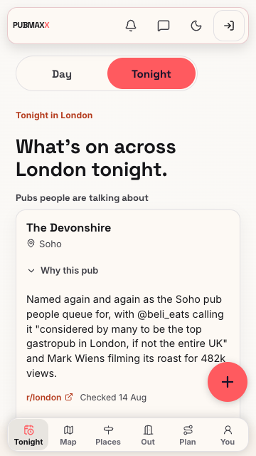

## Validation

The corrected repository consent spec first failed both Tonight size checks. The repaired production suite passed all 18 tests with zero retries. The separate light/dark matrix passed all 16 journeys across `/`, `/tonight`, `/places` and `/social` at both sizes. Each journey checks fresh-reader absence, post-answer appearance, actual content clearance, no analytics before Allow and No thanks persistence. Tonight also checks that the first map action is above the dock and receives a tap at its centre, and that its complete explanation and source remain accessible.

The original unchanged suite passed 12 tests. Later green checks against `.tonightRow` and the landing photo were insufficient. They missed the actual first hyped row and landing action. The repository spec now measures those actual targets.

The nine focused landing, Places, consent and native first-run unit files passed 129 tests. The three Tonight source and weather files passed 23 tests. Native first-run timing remains covered by the existing tests. This is local browser and unit proof, not native-device runtime or production-deployment proof.

[Raw matrix metrics](metrics.json) retain the measured boxes and CLS. Tonight's fresh and answered CLS stayed at 0.003568085449315612 at 320x568 and 0.002498155381944444 at 360x640. Landing stayed at 0 and 0.0029979654947916664 respectively. Both themes matched. Consent introduced no measured CLS increase.

The read-only tab bar inventory records cold streaming, a real Tonight tab click and history Back. The 320/360 light/dark runs sampled 801..803 times per journey. They recorded an initial empty document, one bar under hidden `DIV#S:0`, then one visible bar with six actionable targets. No duplicate bar appeared in those sampled journeys. This does not establish absence for all possible timing conditions. The additional 390x844 light/dark journeys sampled 802 and 800 times on the modified repair bundle. They recorded the same hidden-to-visible transition, a maximum of one bar, and six actionable targets during navigation and Back. The raw source diff and production base accompany those records. No tab bar source changed.

Installed Chrome supplied browser proof because the shared bundled Playwright headless shell was unavailable. No shared browser cache or download changed.

The full `npm run verify:no-mistakes` gate passed. Coverage reported 21,421 passed tests and one existing skipped test. The disposable PostgreSQL passes reported 554 tests plus 10 harness tests. Lint, database type drift, type checks, dead-code checks, the e2e skip fence, freshness checks and the dependency audit completed successfully. Three credential-dependent stores remained unmeasurable and were not claimed fresh.

## Nested disclosure correction

Opening "7 more pubs" previously rotated the arrows for every closed "Why this pub" disclosure inside it. The outer rotation rule now selects only its own summary. Each nested arrow follows its own open state.

The published head `034a1bbe8d67793faf0864bbcc5e563321f965f6` failed four browser cases at 320x568 and 360x640 in both themes. Its closed nested arrows had a computed rotation of 180 degrees. The corrected production bundle passed all four cases with zero retries. Closed arrows now have no rotation. Open arrows retain their 180-degree rotation, explanation and source.

| Phone and theme | Before, closed nested details | After, closed nested details | After, open nested details |
| --- | --- | --- | --- |
| 320x568 dark |  | 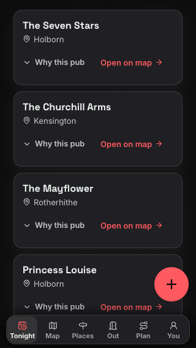 | 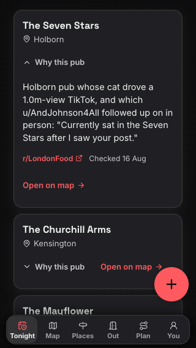 |
| 320x568 light | 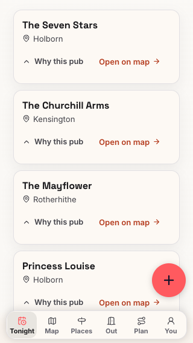 |  | 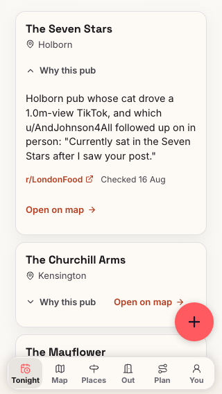 |
| 360x640 dark | 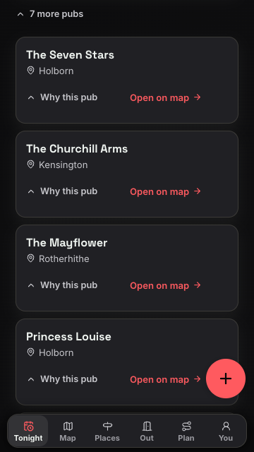 |  | 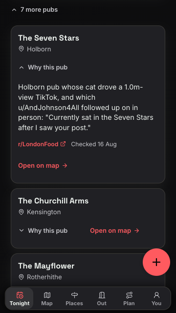 |
| 360x640 light | 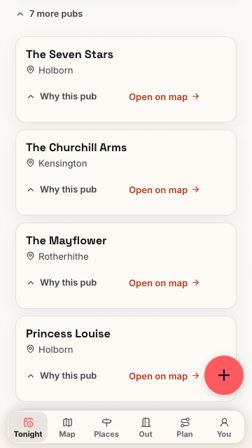 |  | 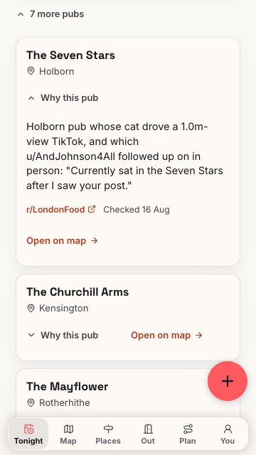 |

[Computed before and after styles](disclosure-styles.json) retain both nested states. The first corrected proof runner sampled the opening animation immediately and failed its open-state assertion. The runner now polls the rendered rotation before recording it. That initial output remains in the ignored proof archive.

The extended repository consent spec also verifies closing the nested details while the outer details stay open. It passed all 18 tests with zero retries. The repeated 16-journey phone matrix and two desktop journeys also passed. All primary-content boxes, consent boxes and CLS measurements matched the previous published proof exactly. No analytics request preceded Allow.
