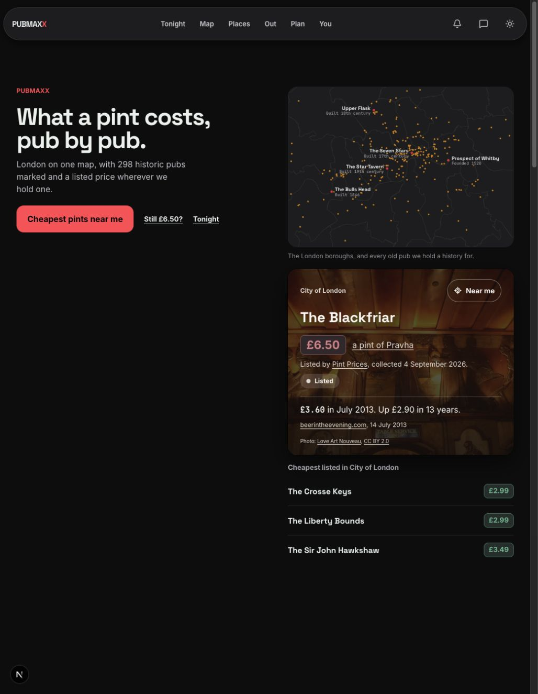
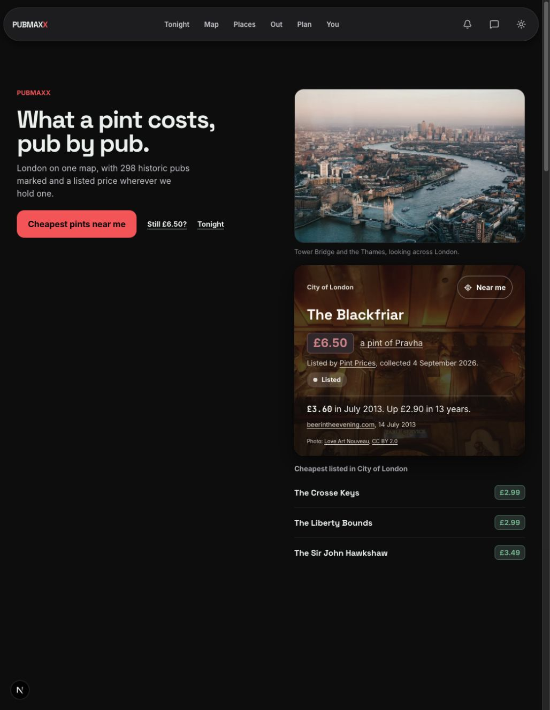

# Landing London view

Desktop browser capture at 1028 x 1325, dark theme, 1 October 2026.

| Before | After |
| --- | --- |
|  |  |

The [front-door rule](../../rules/components-design-system-and-launch-primitives.md#the-front-door-shows-london-then-answers-in-one-tap) owns the current picture and action contracts. [Photo provenance](../../../public/landing/ATTRIBUTION.md) records the source and licence.

Browser checks: `e2e/landing-london-photo.spec.ts` covers 320, 390, 768, 1150 and 1440 pixel widths at DPR 2. It holds the skyline request to measure reserved space, then checks decode, source selection, a single image request, unchanged primary position and no horizontal overflow. It also waits for the lazy pub-card photograph to decode. `e2e/landing-find-my-pint.spec.ts` checks that the primary action stays above the fold and the price contribution path still opens.
