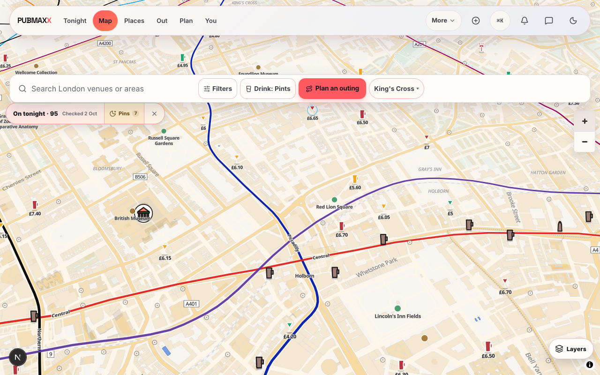
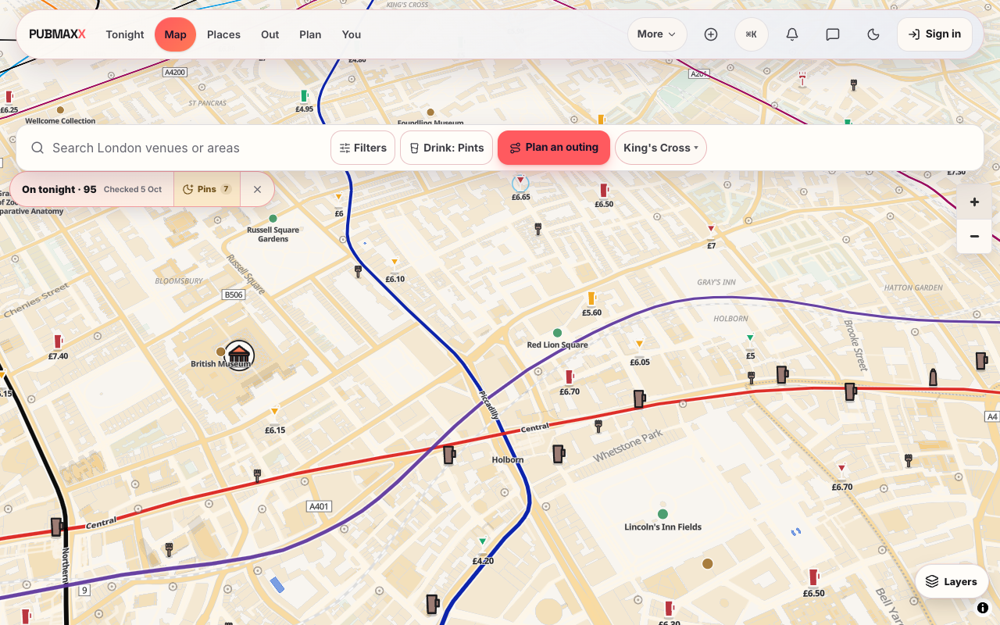
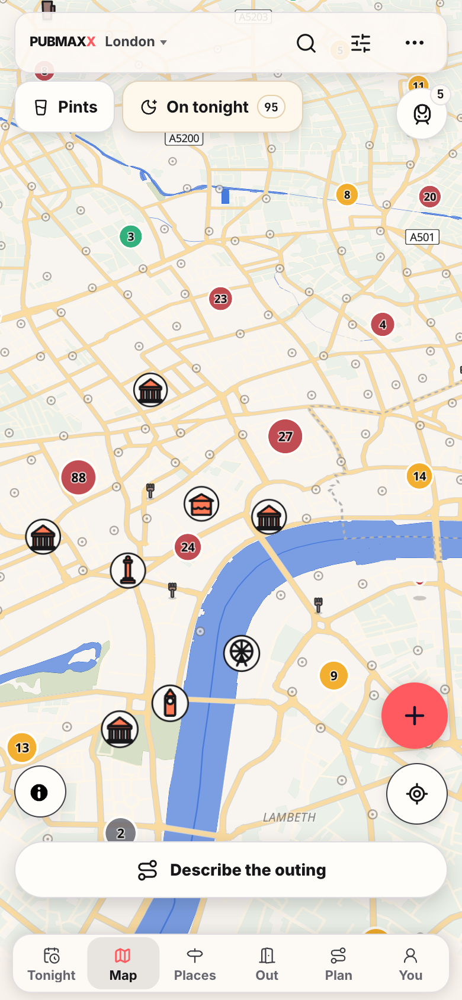
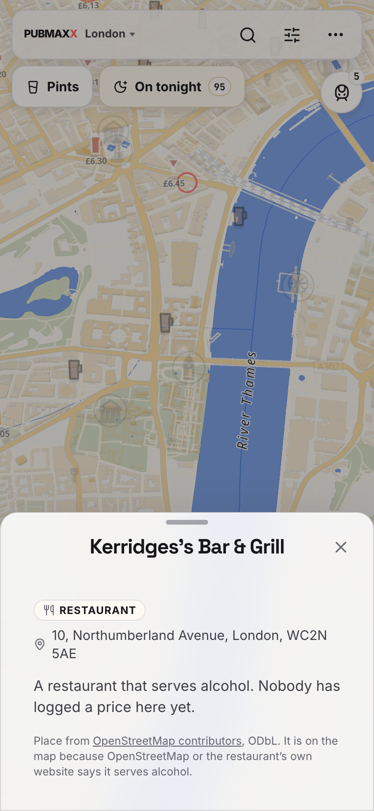

# London restaurants on the map

The 1,094 restaurants on the London venue layer that serve alcohol (171 that
OpenStreetMap tags with a bar or alcohol, 923 whose own website says so) were in
the data but not drawn. They are now drawn from zoom 12 as unpriced fork pins.

## Before and after

The same desktop camera over Holborn (1280x800, `/map`, zoomed in three steps).
The before shot is a development server built from `c0f6bf142`; the after shot is
a production build of this branch.

| Before | After |
| --- | --- |
|  |  |

After, at the phone's opening zoom (390x844, zoom 12): a few forks place where
no pub or curated pin claims the spot, and the rest wait for a closer zoom.

A tap on a fork opens the restaurant's sheet, with no price on it:

## Measured

- The pack `public/data/london_restaurants/restaurants.json`: 1,094 rows,
  121,235 bytes, 37,564 bytes gzipped, read once per visit after the priced
  pins paint. Reading the London venue shards for the same rows instead would
  cost over a megabyte at zoom 12 in central London.
- `data-london-restaurant-count` on the opening London map: 1,078, because
  16 restaurants have a curated twin (same name within 75 m) that is already
  pinned.
- `e2e/map-london-restaurants.spec.ts`, production build on port 3412,
  `--repeat-each=25 --retries=0 --workers=1`: 50 passed, 0 failed.
