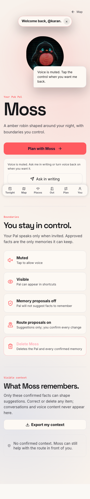
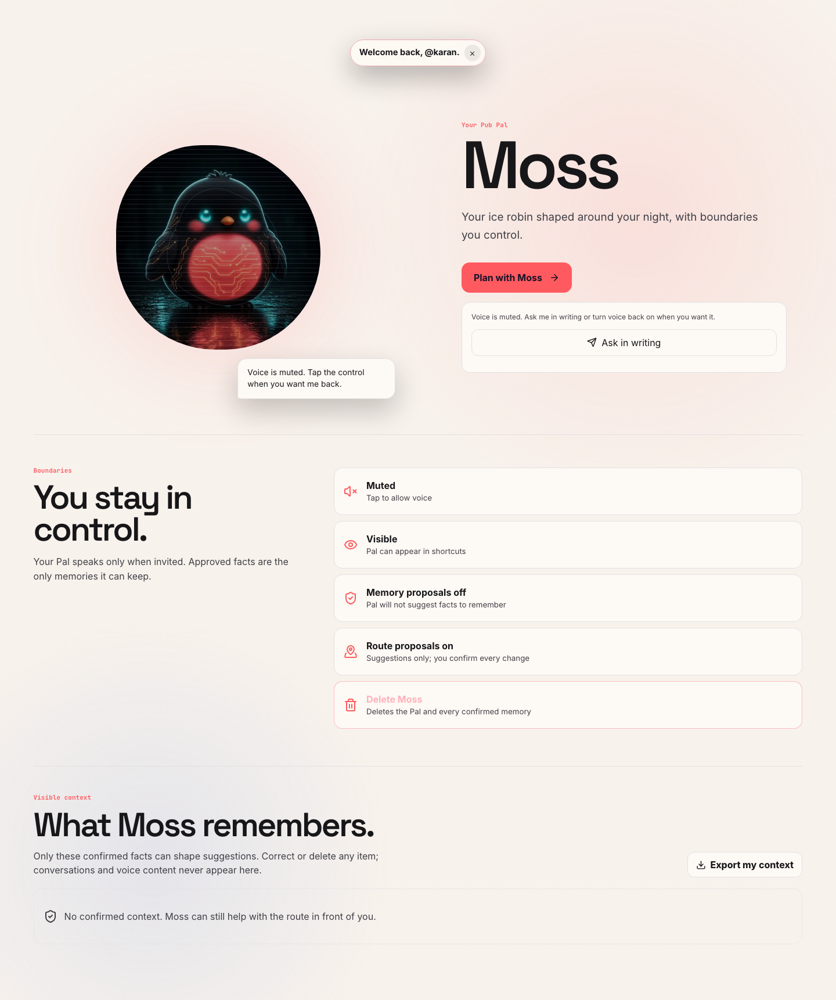

# Pub Pal appearance wording, 5 October 2026

The signed-in home description said "A amber robin" for Beer and "A ice robin" for Vodka.
The correction uses "Your" before each appearance adjective.

Both captures use the real Next.js production page, styles and portrait assets.
The browser session and public Pal API responses use synthetic fixtures.
This proves rendered wording. It does not prove hosted authentication, durable storage or live voice.

| Surface | Before | After |
| --- | --- | --- |
| Beer, 390 x 844 | "A amber robin shaped around your night, with boundaries you control." | "Your amber robin shaped around your night, with boundaries you control." |
| Vodka, 1440 x 900 | "A ice robin shaped around your night, with boundaries you control." | "Your ice robin shaped around your night, with boundaries you control." |

Each browser case loaded the Pal response and portrait, with no page errors.
The six mounted appearance cases failed before the fix.
All ten mounted cases passed after the fix, including the four existing onboarding cases.

## Beer on a phone

## Vodka on desktop

