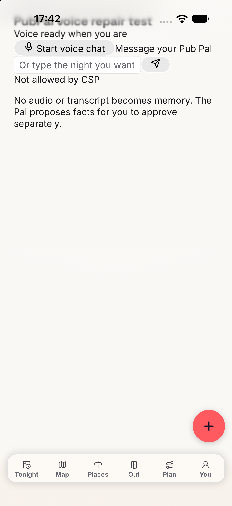
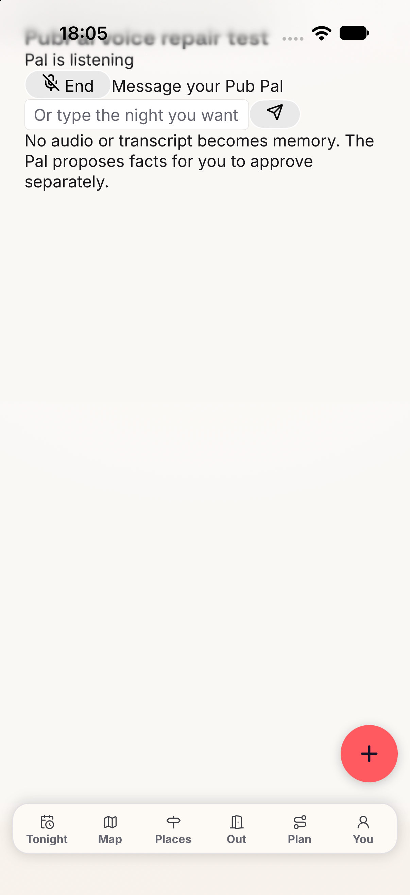

# Pub Pal voice and greeting repair

Recorded on 7 October 2026. The live agent and production database were not changed. No deployment ran.

## Playback before and after

The same temporary page mounted the unchanged `PubPalVoiceSession` component in a Capacitor WebView on iOS 27.0.
The selected simulator was `pubmax-pubpal-greeting-repair`, an iPhone 18 Pro.
Both runs used a local production build and the unchanged production CSP.
The local proxy supplied signed URLs and simulated auth, grants, and tool-turn storage.
I granted microphone permission before the test.

The baseline used React SDK 1.16.0 and client SDK 1.26.0.
Playback requested the jsDelivr resampler. The CSP rejected that request, and the SDK closed the socket with code 1000.
The provider reported zero seconds, zero messages, and no generated audio.

The repair used the published React SDK 1.17.0 and client SDK 1.27.0.
Playback loaded `/vendor/elevenlabs/libsamplerate.worklet.js` and `/vendor/elevenlabs/audio-concat-processor.js` successfully.
The socket received two audio packets, with 41,952 and 83,920 base64 characters.
The UI reported `Pal is listening` until the local 35-second test cap ended the call.
The provider reported 36 seconds, one message, 2.9500625 generated audio seconds, and 31.768 input audio seconds.
The trace contains no CDN request or CSP rejection.

The page observed WebSocket and AudioWorklet events. It did not map URLs or replace the SDK.
The successful resampler load exercises playback at a different output sample rate from the provider rate.
A second start supplied the connected screenshot after a session interruption delayed screenshot capture during the first start.

| Before | After |
| --- | --- |
|  |  |

The screenshots show the temporary test page, not the `/pal` layout.
The native microphone and scene setup was temporary and identical in both runs.
The test proves received audio and a sustained WebView conversation.
It does not prove physical-phone audibility, a spoken two-way turn, or production auth and billing.

The recorded evidence is in [native-before.jsonl](native-before.jsonl), [native-after.jsonl](native-after.jsonl), and [provider-native.json](provider-native.json).
The dependency tree is in [dependencies-after.txt](dependencies-after.txt).

## Greeting behavior

Disposable ElevenLabs agents used the provisioner's before and after prompts, tool descriptions, Gemini 2.5 Flash Lite, and temperature zero.
Client tools replaced the webhook transports. Tool replies used constant local responses, so no production webhook ran.
Typed inputs included the server's memory preamble and current-message label. Voice-shaped inputs contained only the current utterance.
These were text-only provider conversations. They test prompt behavior rather than spoken recognition or production chat admission.
The test deleted both disposable agents after their runs.

Before the repair, typed `hi`, voice-shaped `hi`, and voice-shaped `thanks` called `recall_memories`.
Some replies discussed confirmed memories instead of the person's night.

| Input | Typed result at `3b393586d` | Voice-shaped result at `3b393586d` |
| --- | --- | --- |
| `hi` | `Hi. What kind of night are you planning?` No tool. | Same reply. No tool. |
| `hello` | `Hi. What kind of night are you planning?` No tool. | Same reply. No tool. |
| `thanks` | `You're welcome.` No tool. | Same reply. No tool. |
| `hi, what's on in Camden tonight?` | `recall_memories`, then `whats_on` with Camden in the query. | `whats_on`, with Camden in the query. |

The provider results are in [provider-before.json](provider-before.json) and [provider-after.json](provider-after.json).
The assertion requires social replies with no tools and at most 25 words. Each greeting must use the short reply shown above.
The Camden request must call `whats_on` or `tonight_now`.

These snapshots are historical evidence. `provider-after.json` exercised the prompt in commit `3b393586d`.
That prompt required one exact greeting reply in every context. The voice-shaped probes did not include the voice opener.
The voice opener already asks "What kind of night are you planning?", so that reply repeated the opener in voice.
A later provider run proved it. After the opener, `hi` got "Hi. What kind of night are you planning?" in all 7 runs.
The model ignored a rule that only applied the reply when it had not yet asked the question.
The prompt now never asks that question in reply to a greeting.
A greeting alone gets "Hey. Where are you heading tonight?" from the agent in typed chat and in voice.
Keyless typed chat does not use the agent. Its route answers social turns itself, as `docs/rules/lib-saves-nudges-rounds-reports-and-pub-pal.md` records.
If the agent has already asked where they are heading, it acknowledges briefly and waits.

Known follow-up: memory recall order remains inconsistent on the first substantive request.
The final typed probe recalled preferences before `whats_on`, despite the supplied empty-memory context.
The voice-shaped probe called `whats_on` without recalling preferences.
Earlier probes also varied. Recall order is an observation, not a blocking assertion for this greeting and playback repair.

The unit tests cover the provisioned policy, deferred memory recall, the neutral message label, and short chat replies without factual cards.
The chat transport tests use a provider mock. They do not establish model selection behavior by themselves.

## Privacy readback

The provisioner already sends `delete_transcript_and_pii: true`, `record_voice: false`, and `zero_retention_mode: true`.
The provider accepted those settings on both disposable agents, then returned `delete_transcript_and_pii: false`.
It retained `record_voice: false`, `zero_retention_mode: true`, and `retention_days: -1`.
This reproduces provider normalization without changing the live agent.
The provisioner continues to request true. This run did not resolve the live privacy drift.

## Validation and cleanup

Both production builds and the temporary iOS simulator build passed.
The baseline focused suite returned eight failures and 26 passes.
The final focused run passed all 46 tests across four suites, including the social-reply tests.
The repository gate passed with 21,001 unit tests, 554 PostgreSQL tests, and 10 handle-concurrency tests.
That run preceded the final prompt adjustment. Final validation follows the committed repair.

I restored the original native source files. I deleted the temporary route, iOS build directory, and simulator app.
The selected simulator returned to its original shutdown state. The local proxy and Next servers stopped by their exact process IDs.
No `pkill` ran. The strict CSP stayed unchanged.

The live agent requires the updated provisioner after deployment. That operator action was outside this repair run.
