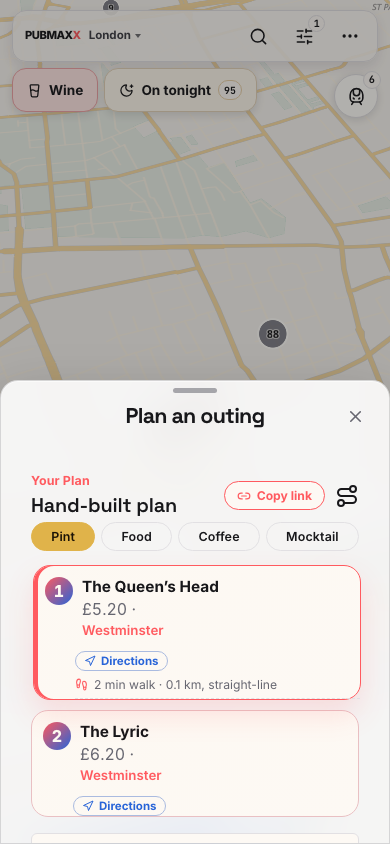
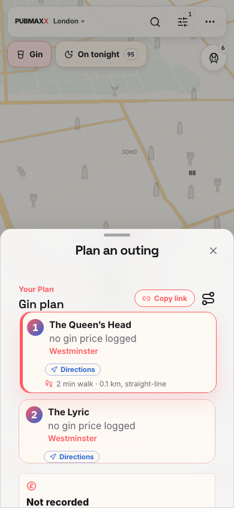
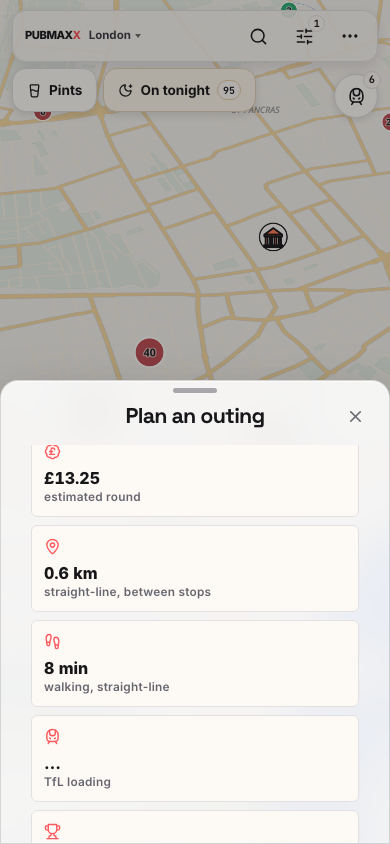
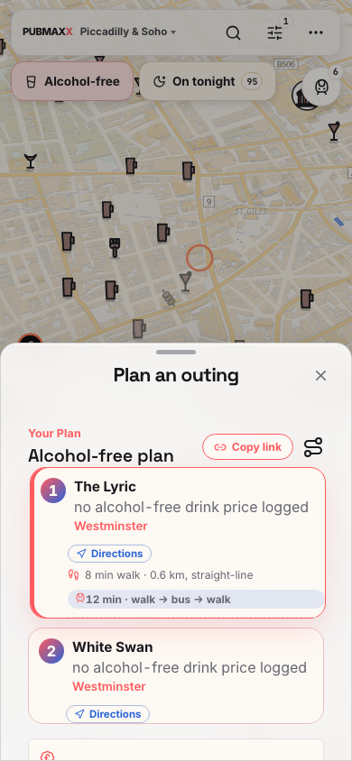
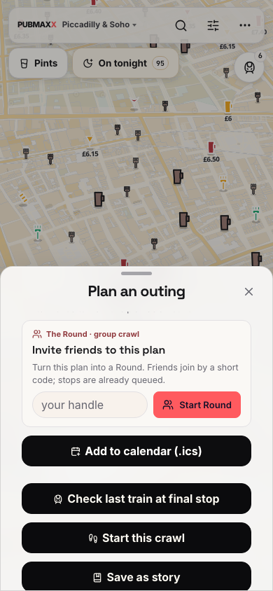
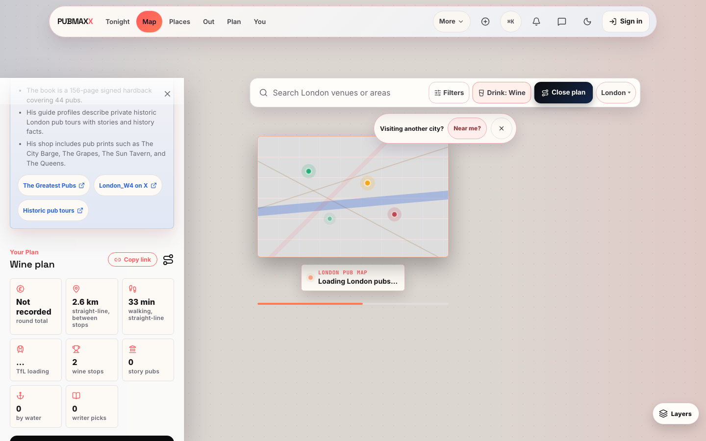

# Selected-drink planning proof, 5 October 2026

A Gin request from a Wine map generated two Gin stops, but activation retained Wine and pint prices. An Alcohol-free request also retained Beer. The corrected map adopts the generated drink and clears incompatible brand and style selections.

These are real local production pages at 390 x 844. The generation POST, venue data, route activation and rendered assets ran through the original keyless Playwright server. No HTML or generation response was fulfilled by a fixture.

| Journey | Before | After |
| --- | --- | --- |
| Wine map, then Gin in Soho |  |  |
| Gin map, then Alcohol-free in Soho |  |  |

The final production build passed all fifteen selected-drink browser cases with the original two workers and no retries. The cases cover Beer, Wine and Gin sharing and reopening, four phone defaults and overrides, unsupported brand refusal, and generated Gin, Alcohol-free, Beer and Cocktail activation. Four unchanged mobile planner, stop-pill and food/no-alcohol journeys also passed. Twelve focused unit files passed 383 cases. Scoped lint passed. The original full gate remains required before publication.

The first review found three connected defects. Generated plans bypassed the drink-lane owner, generated Beer retained a previous Mocktail calendar label, and explicit Beer share links reopened without a mapped route. The repairs use the existing lane owner, restore Pint for generated Beer and preserve completed Beer mapping. Eager and deferred city seeds use the same canonical Beer filter. Plain and refined drink landings retain their clean-map behaviour.

A final review also found that the 300 ms URL synchronization dropped the explicit Beer setting after reload. The real Copy link action copied that omitted setting. The repair keeps the original share intent while the plan context stays unchanged. Deferred curated hydration can supply its first style and display without changing the drink or stops. Later display, style, plan or filter edits release the intent permanently. Selection, curated identity, history and hashes remain intact. The Victorian Soho and Soho food browser cases check the actual copied link and reload. Mounted tests also exercise the real catalogue hydration and immediate history close.

A completed Beer share explicitly preserves `drink=beer`, including after synchronization and the real Copy link action. Generating Beer restores the default lane, whose canonical map URL omits `drink`. The browser checks the generated API category, selected Pint control, cleared refinements, mapped share reopening and calendar noun. It also waits through the debounce and reads the actual clipboard link. A separate ordinary Beer case retains the omitted default setting. Executable tests also cover deferred city seeding and unchanged same-lane control taps.

Two further connected repairs preserve the generated result when its form moves within the planner and hydrate priced slim stops that lack a pint identity. Existing stop ceilings, settled-readiness checks and attempted-request exclusions remain intact. Earlier failing runs remain in private evidence. The after images above come from the seventeen-case run before the final curated-style repair. The following desktop image comes from the earlier matching selected-drink presentation capture.

The following 1440 x 900 capture shows the Wine route's selected-drink title and unknown round total. Its loading map does not establish map readiness or pin performance.

These results establish local keyless behaviour. They do not establish hosted Auth or Storage, live voice, private GPS, Core Web Vitals, production deployment or every route. The original full merge gate and Native review must complete before publication. This is a dated record, not a claim about the deployed website.
