# Skills and packages, 7 Oct 2026

This maintenance change updates 36 direct application dependency requirements and two MCP map dependencies. It refreshes 58 project skill files and adds the upstream `state-machine` skill required by the refreshed `variant` guidance.

## Compatibility and provenance

The project skill sources and exact revisions are recorded in [.agents/skills/SOURCES.md](../../../.agents/skills/SOURCES.md). Eleven upstream repositories were checked. Existing namespace aliases, Capacitor 8 install pins, the Vercel scope fix, and removed shell installers remain. Upstream CHANGELOG.md files were preserved.

Next.js moves from 16.3.8 to 16.4.0. MapLibre moves from 6.11.2 to 6.13.0. Capacitor core, CLI, iOS and Android move from 8.5.2 to 8.5.3. `npx cap sync` rewrote only `ios/App/CapApp-SPM/Package.swift`, and Xcode resolved `capacitor-swift-pm` 8.5.3 at its tagged commit in `Package.resolved`. The application keeps TypeScript 6.0.3 for Next.js's compiler API. The separate native typecheck already uses TypeScript 7.0.2. Both package lockfiles were regenerated by npm.

## Validation

- With the first package set, `npm run verify` passed. The coverage suite passed 20,997 tests, with one deliberate skip. PostgreSQL session checks passed 554 tests. Harness hygiene checks passed 10 tests.
- `NEXT_DIST_DIR=.next-prod npm run build` passed on Next.js 16.4.0.
- `npm audit --omit=dev` reported zero advisories. The full audit reported five dependency-path findings caused by one `braces` advisory in the development lint chain. The registry's latest `braces` is 3.0.3, which is still affected. npm's suggested downgrade to Next.js 14 was not applied.
- Later on 7 Oct, npm published patch releases of `ai`, `@ai-sdk/otel`, `effect`, `@supabase/supabase-js` and the four Capacitor 8 core packages. This change includes them. `npm outdated` now reports only the deliberate TypeScript 6 compatibility pin.
- With that final package set, `NEXT_DIST_DIR=.next-prod npm run build`, `npm run typecheck`, the native unit tests and `npm run ios:build` passed. `npm audit --omit=dev` found no vulnerabilities. `npm run android:build` passed with JDK 21.0.12.1 set through `JAVA_HOME`, running `assembleDebug` and `testDebugUnitTest`. It wrote a debug APK without Firebase push, because `google-services.json` is not in this tree.
- `e2e/map-arrival-card-pins.spec.ts` passed 30 of 30 runs, two tests repeated 15 times with no retries. A temporary copy that put `inert` on the map canvas wrapper failed, because no tappable pin remained.

## Live review

Computer Use checked pubmaxxing.com at desktop 1440 × 900 and mobile 390 × 844. The review covered the landing page, map search and venue sheet, Tonight, Out, the stored plan preview, Pub Pal, and the signed-in profile.

A desktop Pub Pal shortcut covered the venue drawer's Share action. A DOM hit check at Share's centre returned the Pal link. The final drawer and spacing checks are recorded below, including the full-width sheets at 641px.

A later production-build check found the attribution button clipping the shortcut's lower corner. A first fix at bottom 42px still covered the Layers button and, with the consent strip shown, the attribution button and the strip. The same check found two older attribution collisions. At 641 without the strip, expanded attribution wraps to two lines and the Layers button covered its collapse button. At 390 the phone shortcut covered the collapsed OpenStreetMap credit once the plan pill mounted, so a tap on the credit opened Pub Pal. Once open, the phone credit ran its last words under its 44px collapse button, because MapLibre reserves 28px for its own 24px button. At 320 the open credit also ran 8px onto Near me.

The desktop map now publishes one Layers berth in `app/globals.css`. Layers sits 54px up, which clears two-line expanded attribution and its 10px margin. With the consent strip it sits at the consent clearance plus 54px. The shortcut reads the same berth and sits 8px above the 44px Layers button. It hides while the Layers panel is open, because the panel rises through that space. Other desktop routes retain the 22px position. On the phone map the credit and the shortcut read one published credit size. The shortcut starts one gap to the right of the credit, and it hides while the credit is expanded across that band. The open credit reserves the collapse button's 44px plus 4px at its right edge and stops short of the map-edge lane. The plan pill, Near me and create positions are unchanged.

A fresh production build was measured with a saved Pub Pal at 641, 1144 and 1440 × 900 and at 390 × 844. At every desktop width the shortcut spans y 742-794 above Layers at 802-846 and attribution at 866-890. With the consent strip it spans y 670-722 above Layers at 730-774, attribution at 794-818 and the strip at 844-900. A point hit at the center of the shortcut, Layers and the attribution button reached that control at all three widths, in both states, with attribution collapsed and expanded. At 641 the expanded attribution's collapse button now receives its own hit. At 1144 and 1440 the shortcut stays clear and tappable beside the left planner and story drawers. At 641 both left drawers are full-width sheets that sit above the shortcut, as before. At all three widths the shortcut returns when the right venue drawer closes, and Share receives its own center-point hit.

At 390, with and without the consent strip, the credit spans x 12-56 and the shortcut x 68-314 on the same row. Open, the credit spans x 12-322 and y 626-690, with its collapse button at x 278-322. No line of text sits under that button, and Near me at x 326-378 stays clear. At 320 the credit spans x 12-56 beside the shortcut at x 68-244. Open, it spans x 12-252 and y 330-414, clear of Near me at x 256-308, y 306-358. At both widths a tap on the credit opens it, its links receive their own hits, and a second tap closes it and the shortcut returns. `e2e/mobile-map-chrome-fit.spec.ts` now renders this at 320, 390 and 430: the 44px tap floor, the centre hits, every link, no text under the button, and Near me kept clear.

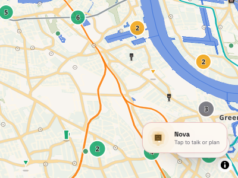

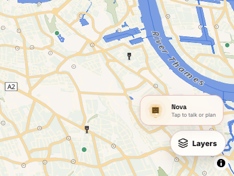

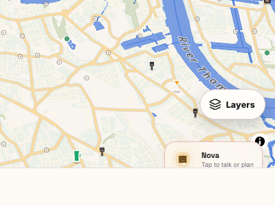

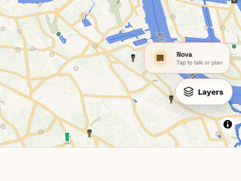

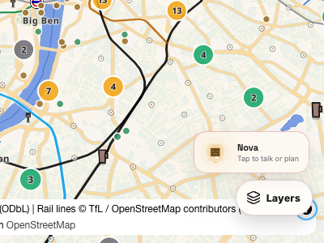

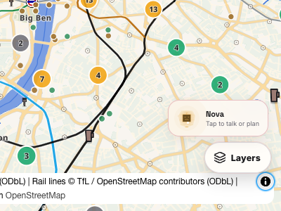

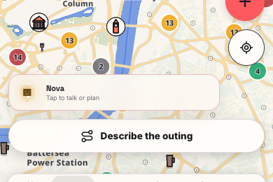

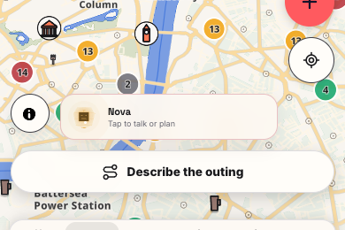

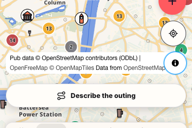

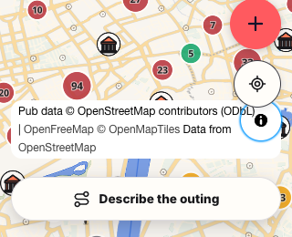

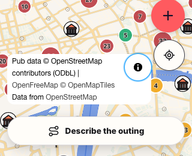

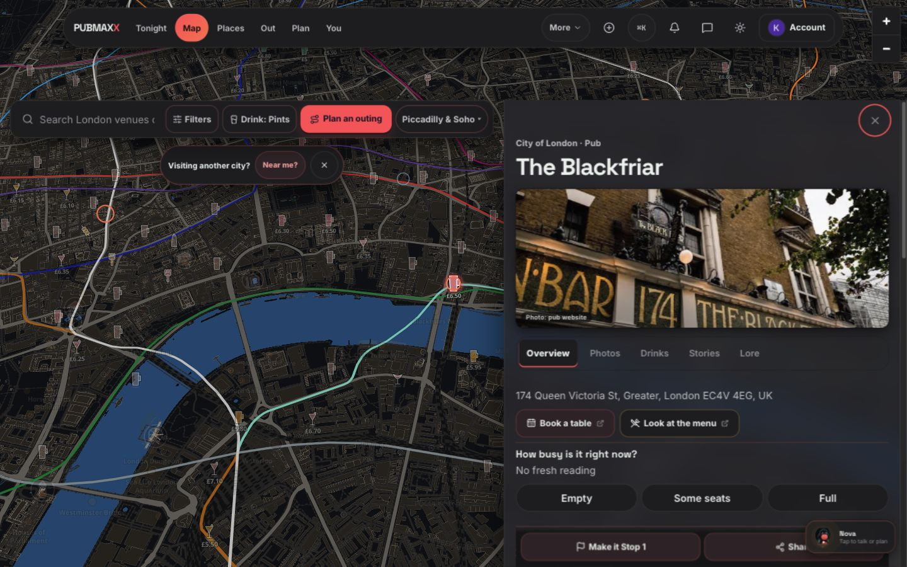

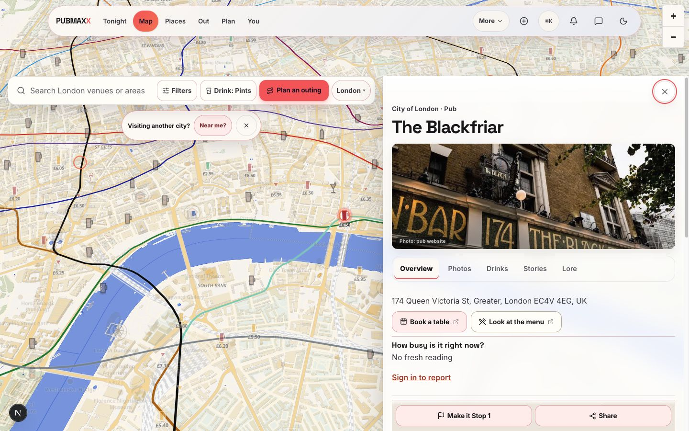

This was a read-only live review. Voice calls, geolocation, account changes, social writes, plan publication, price submission, and real device behavior were not tested. Live production review does not prove the dependency changes are deployed.

## Review correction, 10 Oct 2026

The 7 Oct screenshots above remain historical evidence. They do not establish story-chip clearance at 320px. Commit `539e8039cbed7fb2d4b423c03ad08a985d043d5a` recorded a remaining 12px overlap and called 320px outside its repair. That statement was not a human containment decision. Review R1 requires a correction at 320px.

A fresh production build at input head `88f0fe0e645ee7319a5406ae31c977b00f7c54b2` reproduced the overlap at 320 × 568. The route was `/map/glasgow?band=subcrawl`, with consent answered and the Place story chip visible. The expanded credit occupied x 12-252 and y 420-504. Its full text wrapped to four lines. The chip occupied y 233-432, so it covered the credit by 12px. The tab bar began at y 514.

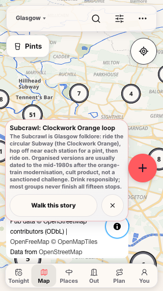

The correction measures the existing credit lane and publishes its height to the map stage. The story chip uses that height and the existing credit berth to reserve its gap. The collapsed control, expanded control, consent berth and width changes use the same placement boundary.

The focused checks also exposed a collapsed-state collision with a saved Pub Pal. The shortcut took the story Dismiss tap at all three phone widths. With the story visible and consent answered, the shortcut now uses the collapsed credit row. Expanded credit retains the existing shortcut visibility rule.

The corrected production build passed. The focused Playwright run passed all 11 cases, with one worker and zero retries. It used the installed Chrome through Playwright's `chrome` channel because the pinned Chromium executable was absent. The run checked 320, 390 and 430px with answered and visible consent, including collapsed, expanded and collapsed-again states. It checked full credit text, links, control hits, story actions, neighbouring controls and tab-bar clearance. The existing three phone credit cases also passed. At 641 and 1440px, attribution, Layers, Pub Pal and the venue Share action received their own hits.

At 320px with answered consent, the corrected chip occupies y 209-408. The credit remains at y 420-504 with four lines, leaving a 12px story gap and 10px before the tab bar. Both story actions receive their own centre hits. The screenshot below includes a saved Pub Pal, which yields to expanded attribution. Its existing presence also raises the right-edge create action.

These checks ran against this review's working-tree corrections over input head `88f0fe0e645ee7319a5406ae31c977b00f7c54b2`. They do not establish CI, publication, deployment or physical-device behaviour. The outer executor owns the remaining native phases.

## Review recipes and current browser proof, 10 Oct 2026

Review R5 now requires a wrapping label for expanded checkbox targets. Review R6 now rejects API errors and dialogue closure before a final frame.

A fresh production build tested the application and existing attribution checks at input head `78e165a059a839a826add8edb844410658d15bd3`. All 11 focused Chrome cases passed, with zero retries. All 13 local recipe checks also passed. Application code and browser assertions remained unchanged.

The [review proof record](review-r5-r6/README.md) preserves raw failures, source hashes, the build receipt, passing reports and the six story/credit geometry screenshots. These results cover this local production build. The outer executor owns the remaining native phases.
