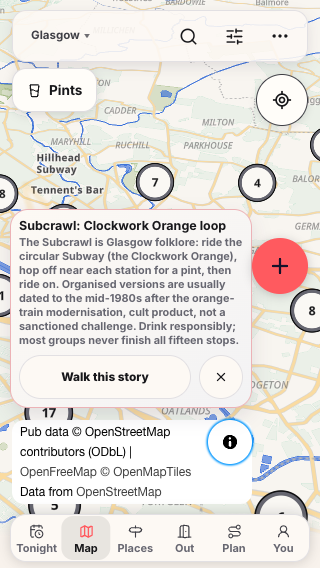
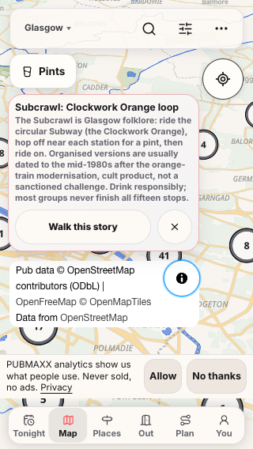

# Review R5 and R6 proof, 10 Oct 2026

The input head was `78e165a059a839a826add8edb844410658d15bd3`. Application code and the existing browser tests remained unchanged. The working tree contained the two skill corrections before verification.

## Local recipe fixtures

The fixtures executed the documented CSS and JavaScript examples. They used installed Chrome and a loopback WebSocket server. They made no provider calls.

The baseline generic checkbox wrapper failed all four expanded-corner taps and the centre tap. Keyboard activation still worked. The baseline dialogue example exited with code 0 after API errors, empty closure, partial closure and transport interruption. Both successful audio fixtures wrote the expected bytes.

After correction, all 13 checks passed. Four expanded-corner taps, a centre tap and keyboard activation toggled the checkbox. Two complete dialogue sequences wrote `hello` and exited with code 0. Five failed sequences exited with code 1. One successful fixture carried audio and `is_final` in the same frame.

The first corrected fixture attempt timed out while its reset helper targeted an input covered by the label pseudo-element. The final fixture reset used the keyboard and checked the resulting state. This changed only the local fixture.

- [Baseline results](before-recipes.json) and [raw baseline failure](before-recipes.log).
- [Corrected results](after-recipes.json) and [raw passing output](after-recipes.log).
- [Initial fixture reset failure](after-recipes-first-attempt.log).
- [Executed fixture runner](recipes.mjs.txt), [original dialogue example](before-dialogue.js.txt) and [corrected dialogue example](after-dialogue.js.txt).

## Production browser proof

Playwright built `.next-review-r5-r6` through `scripts/run-with-restored-next-env.mjs`, then served it on port 3482. It used the root configuration's keyless server environment. The build ID was `build-TfctsWXpff2fKS`.

The browser used the installed `chrome` channel, SwiftShader flags and blocked service workers, matching the previous R1 route. One worker ran the 11 existing tests. All 11 passed, with zero failures, skips, flakes or retries. No existing test, assertion, limit or retry setting changed.

The cases covered 320 × 568, 390 × 844 and 430 × 932 phone viewports. They checked credit styling, geometry, text, links, hit ownership and neighbouring controls. The story cases covered answered and visible consent through collapsed, expanded and collapsed-again credit states. Desktop cases checked credit, Layers, Pub Pal and the venue Share action at 641 and 1440px.

At 320px with answered consent, the story ended at y 408 and the four-line credit started at y 420. The credit ended at y 504, above the tab bar at y 514. With visible consent, the story ended at y 318 and the credit started at y 330. Both story actions and all credit links owned their hits.

- [Raw build and browser output](browser.log).
- [Raw Playwright report](browser-results.json), including all six screenshot and geometry attachments.
- [Exact source hashes](source-receipt.json), [configuration snapshot](playwright.config.ts.txt) and [build and run receipt](receipt.json).
- [Initial temporary configuration syntax failure](browser-config-failure.log) and [initial server working-directory failure](browser-cwd-failure.log).
- [320px answered-consent geometry](320-story-consent-answered.json) and [visible-consent geometry](320-story-consent-visible.json).

The fresh build occupied 576,654,472 bytes. The host retained 6,892,883,968 free bytes after the run. Playwright stopped its server, and port 3482 was free. Peak incremental RAM was not measured.

These are local production-build results. The outer executor owns the remaining test, lint, publication and CI phases. The previous R1 records remain unchanged.
