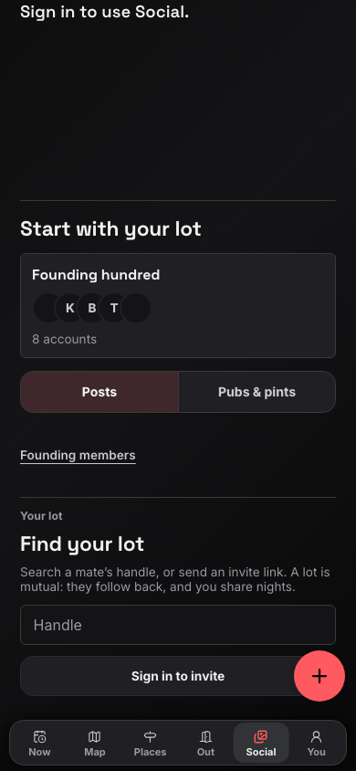
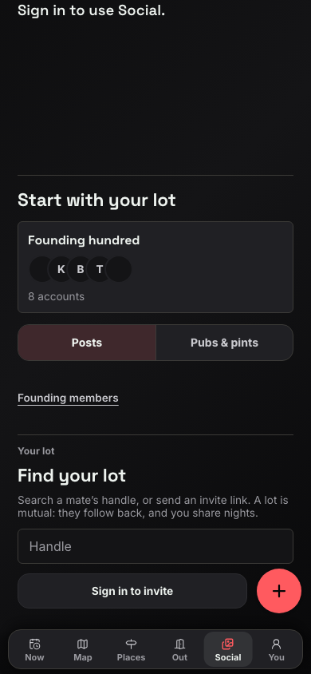

# Social invite clearance

Scope: the signed-out `Sign in to invite` action in [#1536](https://github.com/Singularityszn/pubmax/issues/1536).
The patch adds `createFabLane` to `FindYourLot`'s invite row.
It uses the existing gutter rule in `components/nav/createFab.css`.
It adds no offset, policy, or global CSS rule.

The Social owner approved this narrow ownership before edits.
Their frozen first release is `a400d383f` on `codex/social-real-life`.
Their subsequent gallery work preserves the mobile order: `socialMain` before `socialControlRail`.
This patch does not replace `SocialPageClient` or change the gallery work.
The parent's Night Mode pill fix and the map owner's Retry fix remain separate.

## Original proof

The issue names Android 16 at 390x844, built from `2d00af6d2`, in light and dark.
Its [Social screenshot](../wrapped-build/android/dark/05-social.png) shows the invite button under the FAB.
An active-plan pill is also present.
This check did not run an emulator or recreate that account or plan state.

## Fresh signed-out production check

Production answered `/api/version` with:

- SHA: `6a759e0ac191d99f10c5e658bc8f2c3a6d3dd419`.
- Deployment: `dpl_88fiZ7i4Cgdfrmu5u1wjnRYCnzYq`.
- Build time: `2026-09-07T21:27:03.621Z`.

Fresh Chromium contexts opened `/social` at 390x844 and 430x844, in light and dark.
No existing browser profile, account session, or cookie was used.
Browser requests other than GET and HEAD were blocked. No invitation or post was submitted.
Consent was set to denied inside each isolated context.

The production invite occupied y=631.16 through 675.16.
The FAB occupied y=712 through 768.
All four cases had zero overlap and nine reachable sampled points.
These results do not reproduce the old native screenshot.
Raw rectangles and hit tests are in [production.json](production.json).

## Release-layout fixture

The frozen release moves the control rail after the main content on phones.
That means the invite can pass through the FAB's vertical band during scrolling.
To check this without a build, the fixture used the rendered production document and:

1. Wrapped its non-rail Social children in `.socialMain`.
2. Placed `.socialControlRail` after that wrapper, matching the frozen release's DOM order.
3. Applied `app/social/social.css` from `a400d383f` and the parent's current `mobileNav.css`.
4. Scrolled the invite's centre to the FAB's centre using normal document scrolling.
5. Compared the existing invite row with the same row using `createFabLane`.

This is a source-layout fixture, not a complete build of the new Social release.
It does not prove the complete release's initial fold, galleries, or native safe-area behaviour.

| Width | Theme | Overlap before | Gap after | Reachable sampled points after |
| --- | --- | --- | --- | --- |
| 390 | Light | 46px by 44px | 12px | 9 of 9 |
| 390 | Dark | 46px by 44px | 12px | 9 of 9 |
| 430 | Light | 46px by 44px | 12px | 9 of 9 |
| 430 | Dark | 46px by 44px | 12px | 9 of 9 |

Before the class change, three sampled points on the right hit the FAB instead of the invite.
After it, all nine hit the invite and its height remained 44px.
Raw rectangles and hit tests are in [release-layout-fixture.json](release-layout-fixture.json).

| Before | After |
| --- | --- |
|  |  |

The local reproduction scripts remain in this worktree's `.e2e` directory:
`social-invite-prod.mjs` and `social-invite-release-fixture.mjs`.

## Focused validation

```sh
node_modules/.bin/vitest run \
  __tests__/findYourLot.test.tsx __tests__/createFabClearance.test.ts \
  --maxWorkers=1
node_modules/.bin/eslint \
  components/social/FindYourLot.tsx e2e/social-invite-clearance.spec.ts \
  --max-warnings=0
```

Result: 14 tests passed. ESLint passed without warnings.
The four browser fixture cases above passed their overlap and hit-target assertions.
No full verification, app build, or simulator ran.

The new `e2e/social-invite-clearance.spec.ts` covers both widths and themes against the integrated page.
It checks horizontal clearance, nine hit-test points, and a trial click without navigating or submitting.
The parent must run that spec on the integrated Social build:

```sh
PW_SKIP_WEBSERVER=1 PW_SKIP_KEYLESS_WEBSERVER=1 PW_PORT=<integration-port> \
  node_modules/.bin/playwright test e2e/social-invite-clearance.spec.ts \
  --project=chromium --workers=1
```

Only the Social invite portion of #1536 is addressed here.
