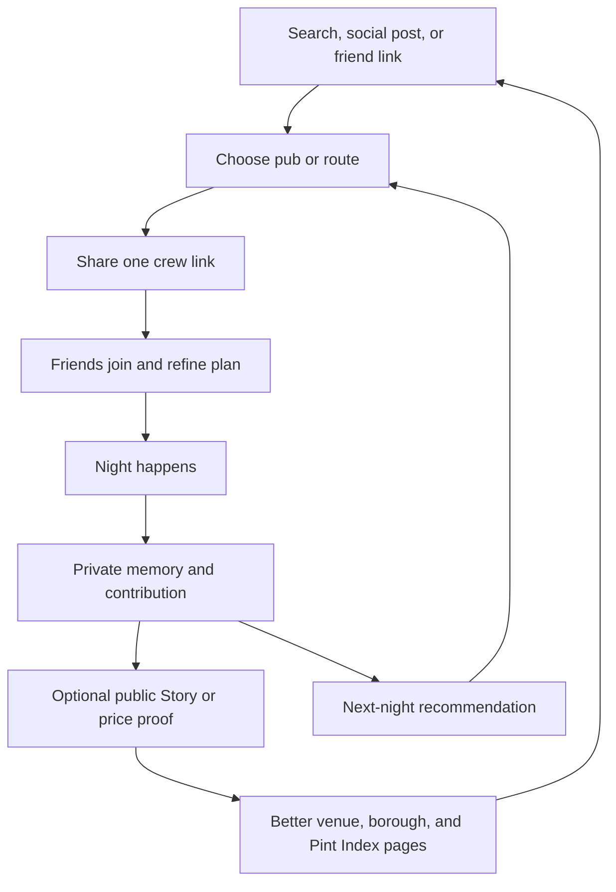

# Deep Research: PUBMAXX Organic Growth, SEO, Retention, And Network Effects

Research date: 10 August 2026  
Market: London first, then United Kingdom  
Decision horizon: next 90 days

## Executive Summary

PUBMAXX should not try to become a generic social network. It should become the fastest trusted answer to one recurring social question: **where should our group go tonight?** The social network should grow from that answer.

Recent public discussion supports four needs:

1. **Value is local and uneven.** One Londoner described a Guinness range of "£3.80 - £7.20" across their locals. Price comparison is useful only when it includes place, drink, date, and source.
2. **Vibe is a separate decision.** A recent London visitor was told that "fun pubs and traditional pubs are two very different vibes." Cheapest alone does not choose a good night.
3. **People want plans they can use with friends.** A recent London borough crawl map prompted another user to say it supplied recommendations for an August bank-holiday crawl.
4. **People reject harmful or invasive mechanics.** Recent discussion criticises high-volume drinking challenges. Foursquare users also criticised a public-by-default check-in change. PUBMAXX must reward discovery, contribution, coordination, and memories, not drink count or public location.

PUBMAXX already has unusually strong foundations: price provenance, Pint Index, map and crawl planning, referrals, crews, Moments, Stories, Night Memories, Pint Passport, consent-gated analytics, programme-level SEO, venue pages, and city pages. Next work should connect these systems into repeatable loops instead of adding another isolated surface.

Recommended strategy:

- Win one job: choose a suitable pub or route in less than 60 seconds.
- Make every useful action create a reusable asset: price proof, saved pub, crew plan, visit memory, or public place page.
- Keep map, price evidence, planning, and joining a crew free.
- Monetise power-user history, alerts, planning tools, and venue operations. Never sell ranking.
- Publish first-party London data that no generic publisher can reproduce.
- Expand cities only after London has repeat weekly use and enough fresh price coverage.

## Key Findings

### 1. Product-Market Fit Is A Decision, Not A Directory

PUBMAXX currently presents a clear public promise: sourced pint prices, one map, and a complete night plan, with no paid ranking. Its public About page reports a meaningful starting corpus across London and nine UK cities. Its live Pint Index also shows why the problem matters: the April 2026 UK draught average was £5.34, while central and outer London can differ materially. Wider reporting connects pub-price pressure to the growing gap between on-trade and shop prices, as well as rising operating costs. [PUBMAXX About](https://pubmaxxing.com/about), [PUBMAXX Pint Index](https://pubmaxxing.com/pint-index), [Morning Advertiser](https://www.morningadvertiser.co.uk/Article/2026/05/21/average-pint-price-rises-33-to-534-the-morning-advertiser-finds/), [Bloomberg](https://www.bloomberg.com/news/articles/2026-01-20/beer-at-double-shop-prices-shows-why-uk-pubs-are-struggling), [Big Issue](https://www.bigissue.com/news/social-justice/pubs-business-rates-10-pound-pint/)

However, price is only one constraint. Recent London requests combine:

- budget;
- atmosphere;
- group type;
- distance and route;
- weather;
- accessibility;
- event or activity;
- food and no-alcohol options;
- a safe route home.

This makes the winning product an **outing decision engine**, not a pub directory. The product should answer a sentence such as: "Four of us, near London Bridge, under £6.50, quiet enough to talk, step-free entrance, outside if dry, home by the last train."

### 2. Utility Must Work Before Friends Join

The best adjacent social products give value with zero friends:

- Swarm stores personal place history, then adds friends, streaks, and mayorships. [Foursquare Swarm](https://apps.apple.com/us/app/swarm-check-in-explore-map/id870161082), [Swarm check-ins](https://support.foursquare.com/hc/en-us/articles/12534514074012-Swarm-check-ins)
- Letterboxd gives every user a diary, reviews, ratings, lists, and personal statistics. Its paid product extends personal value rather than locking the social graph. [Letterboxd Pro](https://letterboxd.com/pro/), [Letterboxd membership](https://letterboxd.com/about/pro/)
- Beli starts with personal ranked lists and taste profiles, then adds friend activity and match scores. [Beli](https://apps.apple.com/us/app/beli/id1478375386)
- Strava starts with activity records and routes, then turns those records into clubs, challenges, recaps, and social support. [Strava subscription features](https://support.strava.com/en-us/articles/15402044-strava-subscription-features), [Strava 2025 Year in Sport](https://press.strava.com/en-gb/articles/strava-releases-12th-annual-year-in-sport-trend-report-2025)
- DICE combines local discovery, personalisation, event inventory, and ticketing. Its acquisition by Fever shows the strategic value of connecting discovery demand to venue supply without making every surface a booking page. [DICE App Store](https://apps.apple.com/gb/app/dice-live-shows/id898358948), [Fever and DICE](https://newsroom.feverup.com/en-US/250537-fever-and-dice-join-forces-to-build-a-live-entertainment-tech-powerhouse/)
- CAMRA's Good Beer Guide shows the enduring value of member-maintained pub evidence and trusted editorial standards, while its real-ale focus leaves room for PUBMAXX's broader outing decision. [CAMRA Good Beer Guide](https://apps.apple.com/gb/app/camras-good-beer-guide/id1233650729), [CAMRA pub search](https://camra.org.uk/pubs)

PUBMAXX already has the right private assets: Passport, Night Memories, saved places, plans, and contribution history. Activation should not require contact import, a public profile, or friends already using the app.

### 3. Existing Social Systems Need One Connected Loop

Current repository plans already cover referral attribution, share artifacts, crews, Stories, Moments, Night Memories, Pint Passport, and event analytics. Rebuilding these would duplicate Fable's work. The next step is to connect them into one lifecycle:



This loop has individual value, group value, public data value, and acquisition value. Each stage strengthens the next without paying users to spam friends.

### 4. The Strongest Organic Moat Is First-Party Evidence

Google states that useful search content should provide original information, first-hand expertise, and a satisfying answer. It warns against extensive automation and scaled content made mainly to rank. [Google people-first content](https://developers.google.com/search/docs/fundamentals/creating-helpful-content), [Google generative AI guidance](https://developers.google.com/search/docs/fundamentals/using-gen-ai-content), [Google spam policies](https://developers.google.com/search/docs/essentials/spam-policies)

PUBMAXX has defensible inputs that generic travel publishers do not:

- dated, sourced, drink-specific prices;
- corroboration and moderation state;
- venue accessibility observations;
- visit reports;
- weather-aware and time-aware planning;
- crawl routes;
- historic pub evidence;
- borough coverage status;
- frozen monthly Pint Index editions.

SEO should expose these facts through useful pages. It should not create thousands of thin combinations.

### 5. Social And Lifestyle Subscriptions Have Weak Retention

RevenueCat's 2026 benchmark covers 115,000 apps and $16 billion in revenue. Its Social and Lifestyle category shows weak retention: roughly 25% annual first-year retention and 42% first monthly renewal in the cited benchmark. It also reports little first-year retention difference between freemium and hard paywalls. Ongoing value matters more than paywall type. Lower-priced annual plans retain better than high-priced annual plans in its dataset. [RevenueCat 2026 benchmarks](https://www.revenuecat.com/blog/growth/subscription-app-trends-benchmarks-2026)

PUBMAXX should not add a broad paywall before repeat utility exists. Consumer subscription should target users who already plan nights, save places, check prices, or review personal history.

### 6. Social Drinking Gamification Has A Clear Ethical Boundary

Untappd proves that check-ins, discovery, badges, and venue subscriptions can scale. It also shows the risk of turning alcohol consumption into a score. A 2026 longitudinal analysis focuses directly on ethical questions in Untappd's gamification. Older research also shows that gamification can bias review and participation behaviour. [What is Untappd](https://help.untappd.com/hc/en-us/articles/360034151911-What-is-Untappd), [Untappd account types](https://help.untappd.com/hc/en-us/articles/360034389711-Untappd-Account-Types), [2026 Untappd ethics paper](https://arxiv.org/abs/2601.04841), [gamification bias research](https://ojs.aaai.org/index.php/ICWSM/article/download/14718/14567/18236)

UK guidance advises people who drink to limit single-occasion consumption, drink slowly, alternate with water, eat, and plan a safe journey home. [UK Chief Medical Officers' guidance](https://www.gov.uk/government/publications/alcohol-consumption-advice-on-low-risk-drinking)

Product rule: reward breadth and meaning, not volume.

- Good: new place, new borough, useful price proof, completed route, crew memory, verified accessibility report.
- Bad: pint streak, fastest crawl, units consumed, drinking leaderboard, incentives tied to alcohol quantity.

## Detailed Analysis

### Current Position

The existing strategy is stronger than a normal V0:

| System | Current value | Next connection |
|---|---|---|
| Map and venue pages | Discovery and price trust | Convert a decision into a crew plan |
| Pint Index | Ownable data and press asset | Borough coverage missions and monthly data release |
| Referrals and crews | Private distribution | Trigger only after a real plan is useful |
| Moments, Stories, Night Memories | Memory and optional publishing | Morning-after recap and next-night seed |
| Pint Passport | Personal history | Meaningful milestones and Pro statistics |
| Community contributions | Better price and venue evidence | Contributor reputation and visible local coverage |
| Analytics | Funnel measurement | Weekly Meaningful Pubmaxxers and cohort retention |
| Sitemap and structured pages | Crawlable surface | Search demand mapped to sufficiently rich pages |

### Recommended Product Position

Use one consumer sentence:

> PUBMAXX picks the right pub for your people, budget, weather, and way home.

Keep price leadership as proof, not the whole identity. A pure cheap-pint proposition attracts one-off bargain searches. A night decision creates weekly relevance and room for no-alcohol, food, accessibility, events, and memories.

### Five Compounding Growth Loops

#### Loop 1: Price Proof

1. Person lands on a price or venue page.
2. Dated evidence helps them choose.
3. They confirm or correct a price after visiting.
4. Corroboration improves the map and Pint Index.
5. Better pages earn search, citations, and local press.

Guardrail: show provenance and uncertainty. Never present a first report as established price authority.

#### Loop 2: Crew Coordination

1. Host makes a plan.
2. One link opens a useful plan before signup.
3. Friends vote, join, or suggest a pub.
4. Accepted plan creates a small crew.
5. Crew receives the next relevant prompt.

Guardrail: never gate joining behind payment. Referral qualification should remain tied to real use, not link creation.

#### Loop 3: Place Memory

1. User records a private night.
2. PUBMAXX creates a concise recap.
3. User may publish one Story or share card.
4. Shared artifact deep-links to the pub or route.
5. Viewer can adapt the plan for their own crew.

Guardrail: memory is private by default. Public sharing is explicit and reversible.

#### Loop 4: Borough Coverage

1. Pint Index shows a specific evidence gap.
2. Local drinkers add corroborated observations.
3. Borough view unlocks only at a clear quality threshold.
4. PUBMAXX publishes a new local finding.
5. Community groups and local media share it.

Guardrail: no manufactured league table. An empty or partial dataset must say so.

#### Loop 5: Venue Operations

1. Venue claims and verifies its page.
2. Venue keeps hours, menu, events, and prices current.
3. Better data improves qualified discovery.
4. Venue sees anonymised demand and update quality.
5. More venues participate because PUBMAXX sends suitable customers.

Guardrail: payment buys tools and measurement, never map rank or editorial praise.

### SEO System

#### What Already Works

Repository review confirms production foundations for canonical URLs, robots, sitemaps, JSON-LD, dynamic Open Graph assets, city and venue surfaces, historic pub pages, Pint Index editions, and internal links. The next SEO wave should be editorial and data-quality work, not another metadata rewrite.

#### Search Architecture

Create or strengthen only pages that can answer a complete decision:

| Intent | Landing surface | Required unique evidence |
|---|---|---|
| Cheap pint near a place | area or landmark view | fresh price rows, dates, sources, route distance |
| Quiet pub for a chat | experience view | visit reports, noise evidence, time context |
| Beer garden today | weather-aware view | outdoor signal, current weather, open status |
| Pub quiz tonight | event view | sourced listing, date, venue, map action |
| Step-free pub | access view | separate entrance and toilet trust states |
| Pub crawl from A to B | crawl view | ordered stops, walking time, return route |
| Historic pub near a station | heritage view | cited history and practical visit data |
| Alcohol-free pub choice | drink-lens view | corroborated category price and availability |

Index a page only when it has enough original evidence to satisfy the intent. Otherwise serve the interactive view without promoting it as a search landing page.

Google supports `LocalBusiness` structured data for business location, hours, reviews, price range, and other details. Mark up only facts shown on the page and supported by PUBMAXX data. [Google LocalBusiness](https://developers.google.com/search/docs/appearance/structured-data/local-business), [Google structured data introduction](https://developers.google.com/search/docs/appearance/structured-data/intro-structured-data)

Use:

- `LocalBusiness` or a suitable subtype on venue pages;
- `Dataset` for Pint Index editions;
- `BreadcrumbList` for city, area, and venue hierarchy;
- `ItemList` for visible ranked or routed collections;
- author and observation dates for eligible community evidence;
- stable canonical URLs for every public asset.

Do not rely on FAQ rich results as a growth strategy. Keep FAQs only when they answer user questions or make data limitations clear.

#### Content Programme

Use the existing content templates, but make the input always a verified PUBMAXX finding.

Weekly cadence:

- Monday: one data question, such as the real Zone 1 premium.
- Tuesday: one pub history with a current visit action.
- Wednesday: tonight or quiz-night planner.
- Thursday: weather and crew decision prompt.
- Friday: live price or borough comparison.
- Sunday: community correction, contribution, or memory recap.

Each item should produce:

1. a canonical on-site page or fact block;
2. one vertical video;
3. one static chart or map card;
4. one Reddit answer adapted to the community's question;
5. one X post or thread;
6. one creator or venue outreach asset.

This is repurposing of original evidence, not six unrelated content tasks.

### Social Research By Platform

#### Reddit

Best observed needs:

- price variance between nearby pubs;
- practical crawl recommendations;
- vibe distinctions;
- specialist beer recommendations;
- personal pub tracking;
- transport-aware exploration;
- safety objections to volume challenges.

Recent threads: [Borough crawl map update](https://www.reddit.com/r/london/comments/1umcf1g/24hour_borough_pub_crawl_map_update/), [London pint prices](https://www.reddit.com/r/LondonPubCrawl/comments/1uml9fu/how_much_are_you_paying_for_a_pint_in_your_local/), [London pub vibes](https://www.reddit.com/r/LondonTravel/comments/1usv3lq/fun_pub_reccomendations/), [Untappd London recommendations](https://www.reddit.com/r/Untappd/comments/1v9118p/london_england_recommendations/), [personal pub history](https://www.reddit.com/r/pubs/comments/1v8s2yu/how_many_different_pubs_have_you_been_to_in_your/), [24-hour crawl](https://www.reddit.com/r/london/comments/1tng3r2/we_completed_a_24hour_pub_crawl_around_every/), [crawl safety criticism](https://www.reddit.com/r/CasualUK/comments/1tyvjpi/pub_crawl_update_weve_done_it/)

Tactic: answer the thread completely before mentioning PUBMAXX. Use a screenshot or mini-map only when it adds evidence. Do not seed fake questions, mass-post, or ask users to upvote.

#### X

Public indexed coverage was sparse because authenticated X search was unavailable. One relevant existing account, London Pub Map, has built a visible audience by documenting one concrete mission: every pub with a London postcode. [London Pub Map on X](https://x.com/LondonPubMap/with_replies)

Tactic: give the founder account one recognisable series, such as "London price proof of the day" or "Tonight's £10 difference." Create a brand account only when it has a clear publishing duty. Avoid a silent corporate account.

#### TikTok, Instagram, And YouTube Shorts

Direct TikTok and Instagram retrieval was not available in this runtime. Public indexed evidence was incomplete. TikTok's 2026 trend report says audiences are moving toward real curiosity, discovery detours, and emotional return rather than pure fantasy or impulse. [TikTok 2026 trend report](https://ads.tiktok.com/business/library/TikTok_Next_2026_Trend_Report.pdf)

Tactic: use human proof and a decision in the first two seconds.

- "This pint changes by £3.40 in a ten-minute walk."
- "Three pubs for a quiet date near Victoria."
- "Sunny at 6, rain at 9. Here is the crawl."
- "Can four people get a good London night for £60?"
- "This pub looks inaccessible. Here is what drinkers have actually confirmed."

Every clip should deep-link to a saved decision, not the generic home page.

#### Product Hunt

Product Hunt can create one launch spike and useful product feedback. It is not the core local network. Launch only after the product can show a complete decision, crew link, and memory loop in one session. Build the launch around a public data finding, not "another pub app."

### Retention System

Retention should follow real weekly triggers:

1. **Thursday or Friday decision:** weather, events, crew availability, saved area.
2. **Plan activity:** friend joined, vote changed, route updated.
3. **Price watch:** a saved pub or favourite drink changed materially.
4. **Morning after:** private recap ready, contribution requested once.
5. **Coverage mission:** a local area needs a small number of corroborated observations.
6. **Return-home warning:** last-train or disruption change for an active plan.

Rules:

- ask for notification permission only after a user creates a relevant trigger;
- let users select frequency and categories;
- never use generic "we miss you" notifications;
- use private-by-default location and history;
- show why each recommendation was sent;
- allow alcohol-free and food-led planning everywhere.

Research on a fitness network found that social connections can increase offline activity. That supports crew coordination and mutual plans, but it does not justify public location or coercive streaks. [Online Actions with Offline Impact](https://arxiv.org/abs/1612.03053)

### Revenue Design

#### Free Forever

- browse map and venue evidence;
- view sourced prices and Pint Index;
- create a basic plan;
- join and vote in a crew;
- contribute prices, access signals, and visit reports;
- keep a basic Passport and Night Memory;
- open every shared public artifact.

This protects network growth and data supply.

#### PUBMAXX Pro

Test only with users who have completed at least two meaningful sessions.

Candidate value:

- advanced personal and crew statistics;
- full private history and export;
- price-watch and event alerts;
- offline route packs;
- advanced multi-constraint planning;
- custom recap and share-card styles;
- deeper comparison and saved filters.

Starting test: £19 to £29 per year, with a monthly option near £2.99. Test willingness before final pricing. Annual should be the default offer because the category is episodic and seasonal.

#### Patron

A higher support tier can offer cosmetic identity, early access, and visible support status. Letterboxd's pattern shows that some users pay to support a trusted cultural product, but recent user criticism also shows the danger of putting ads into a paid experience. [Letterboxd membership](https://letterboxd.com/about/pro/)

#### PUBMAXX For Venues

Paid venue tools can include:

- verified operator access;
- price, menu, hour, accessibility, and event updates;
- update history and correction workflow;
- anonymised search and plan demand;
- campaign links and conversion measurement;
- printable QR assets;
- staff roles and change approval.

Start with five to ten independent venues. Charge only after operators repeatedly use the workflow. Candidate range: £29 to £79 per venue per month, based on included operations and analytics. Never alter organic rank.

#### Other Revenue

- ticket or reservation affiliate fees;
- clearly labelled transport or safe-ride referral fees;
- sponsored editorial with explicit `Ad` labelling;
- licensed, aggregated market data that cannot identify users.

UK guidance requires social and influencer advertising to be clearly identifiable. Alcohol marketing must not target under-18s, encourage immoderate drinking, or use youth-appealing creative. [ASA social ad disclosure](https://www.asa.org.uk/advice-online/recognising-ads-social-media.html), [ASA alcohol rules](https://www.asa.org.uk/topic/alcohol.html), [ASA alcohol promotions](https://www.asa.org.uk/advice-online/alcohol-promotional-marketing.html)

### Trust, Safety, And Privacy

Trust is product growth infrastructure.

- Location permission only while needed. ICO guidance suggests considering while-in-use access instead of continuous background tracking. [ICO location settings](https://ico.org.uk/switched-on-to-privacy/choosing-settings/location-settings/)
- A check-in or visit remains private until the user publishes it.
- Crew live location is off by default, time-limited, and revocable.
- Never infer intoxication or health status.
- Separate alcohol-free discovery from alcohol marketing.
- Make paid relationships visible at the card and result level.
- Keep moderation provenance and reversible hides.
- Apply age-aware distribution before running alcohol-related paid social campaigns.

Foursquare's current product illustrates the privacy risk. Recent users criticised public-by-default check-ins after an app change. PUBMAXX should treat privacy defaults as a retention feature, not a legal footer.

### 90-Day Plan

#### Days 0 To 30: Prove Activation

Goal: a new user makes one confident outing decision in less than 60 seconds.

- Define a single activation event: suitable pub chosen or crew plan accepted.
- Measure time to decision, map-to-plan rate, plan acceptance, and second session.
- Build one multi-constraint "Sort the outing" entry path around budget, vibe, weather, access, and return home.
- Connect selected result to existing crew link.
- Add one morning-after recap that uses existing Night Memory.
- Start a five-borough coverage pilot using Pint Index evidence gaps.
- Publish one original data story each week.
- Establish founder-led Reddit and X participation.
- Verify Search Console, sitemap health, canonical host, and indexed page quality.

Exit criteria:

- at least 35% of qualified new sessions reach an outing decision;
- median time to decision under 60 seconds;
- at least 20% of accepted plans include a second person;
- reliable cohort baseline for week-one return.

#### Days 31 To 60: Prove Loops

Goal: one useful night creates the next user or next session.

- Deep-link shared plans to an editable copy.
- Add saved-pub price watch for proven repeat users.
- Turn recap cards into venue and route entry points.
- Connect borough evidence gaps to contribution prompts.
- Pilot verified venue operations with five to ten venues.
- Create rich search pages only for intents with sufficient unique data.
- Partner with five London micro-creators or pub specialists using first-party data packs.
- Run one local community data release, not a generic launch announcement.

Exit criteria:

- invite-to-join conversion above 25%;
- at least 15% of completed plans create a contribution or memory;
- at least 20% of activated users return within four weeks;
- venue operators update information without staff assistance.

#### Days 61 To 90: Prove Revenue

Goal: monetise repeat value without harming the free network.

- Test Pro only with activated repeat users.
- Compare annual and monthly offers.
- Keep all group joining and public evidence free.
- Test venue subscription with the pilot cohort.
- Add one clearly labelled affiliate flow only if it improves the night.
- Prepare Product Hunt and press only when retention and the complete loop are demonstrable.
- Expand one additional city only if fresh evidence density and local operator supply are ready.

Exit criteria:

- at least 5% of eligible repeat users start a paid trial or buy annual Pro;
- first monthly renewal above the category benchmark directionally, with an internal target above 50%;
- at least three pilot venues pay or sign a paid letter of intent;
- no material decline in contribution, crew joining, or trust reports after monetisation.

## Measurement

Use one north star: **Weekly Meaningful Pubmaxxers**.

A meaningful user does at least one of:

- chooses a venue from a decision flow;
- creates or accepts a plan;
- contributes accepted evidence;
- records a Night Memory;
- publishes or opens a Story that leads to a map action.

Supporting scorecard:

| Layer | Primary metric | Guardrail |
|---|---|---|
| Acquisition | non-brand organic sessions to decision | thin-page index count |
| Activation | suitable pub chosen or plan accepted | median time to decision |
| Network | accepted crew members per plan | invite spam/report rate |
| Retention | week-one and week-four meaningful return | notification opt-out |
| Supply | fresh corroborated price coverage | correction and hide rate |
| Content | content-to-map action | visits without useful action |
| Consumer revenue | eligible-user conversion and renewal | free-loop conversion change |
| Venue revenue | active paid venues and monthly usage | paid-rank complaints |
| Trust | false-price and privacy complaints | moderation response time |

Do not optimise raw installs, total profiles, total page views, or total drinks logged.

## Contrarian Views And Risks

### Risk: Cheapest-Pint Branding Attracts Low-Loyalty Traffic

Mitigation: lead with "right pub for this night." Use price as trusted evidence and savings as a result.

### Risk: Social Features Create An Empty Room

Mitigation: keep personal utility complete. Introduce social actions after a plan, contribution, or memory exists.

### Risk: Programmatic SEO Becomes Scaled Content Abuse

Mitigation: index only pages with original, sufficient, current evidence. Quality threshold before sitemap inclusion.

### Risk: Gamification Encourages Harmful Drinking

Mitigation: reward place breadth, social coordination, verified contributions, safe route planning, and alcohol-free choices. Ban volume metrics from rewards and leaderboards.

### Risk: Venue Money Damages Trust

Mitigation: sell workflow and analytics. Keep organic ranking independent. Label every paid placement.

### Risk: Public Location Reduces Retention

Mitigation: private default, explicit audience, expiry, and delete controls. No silent default changes.

### Risk: City Expansion Dilutes Evidence

Mitigation: require minimum local price freshness, venue detail, and contributor density before marketing a city as live.

### Risk: Subscription Arrives Before Habit

Mitigation: expose offers only after repeat value. Keep core network and public data free.

## Open Questions

These are measurement questions, not blockers for the first 30 days:

1. Which entry intent produces the best repeat cohort: cheap price, vibe, event, weather, or crew plan?
2. What percentage of users plan for tonight versus a later date?
3. Which private asset creates the strongest return: saved pub, Passport, price watch, or Night Memory?
4. Do venue operators value demand analytics, update tools, or QR contribution most?
5. Which borough has enough density for the first complete local network?
6. What evidence threshold makes a search landing page genuinely useful?
7. What age and content controls are needed before paid social promotion?

## Immediate Decisions

1. Adopt "choose the right pub for your people and night" as product frame.
2. Make outing decision the activation event.
3. Connect existing plan, crew, memory, contribution, and share systems into one lifecycle.
4. Keep core utility and crew joining free.
5. Delay consumer paywall until repeat cohorts exist.
6. Start a five-borough coverage and content pilot.
7. Reward discovery and evidence, never alcohol volume.
8. Keep location and memories private by default.
9. Sell venue tools, never ranking.
10. Use London as the proof market before broad UK expansion.

## Sources

### PUBMAXX And UK Pub Context

- [PUBMAXX About](https://pubmaxxing.com/about) - current positioning, corpus, and no-paid-ranking promise.
- [PUBMAXX Pint Index](https://pubmaxxing.com/pint-index) - live price evidence, zone comparison, and borough data gaps.
- [Morning Advertiser average pint price](https://www.morningadvertiser.co.uk/Article/2026/05/21/average-pint-price-rises-33-to-534-the-morning-advertiser-finds/) - April 2026 UK draught average.
- [Bloomberg on pub and shop prices](https://www.bloomberg.com/news/articles/2026-01-20/beer-at-double-shop-prices-shows-why-uk-pubs-are-struggling) - price pressure and on-trade versus retail comparison.
- [Big Issue on pub operating pressure](https://www.bigissue.com/news/social-justice/pubs-business-rates-10-pound-pint/) - publican and consumer views on cost pressure.
- [CAMRA pubs and wellbeing](https://camra.org.uk/about/pubs-and-wellbeing) - pubs as community and social-connection infrastructure.
- [UK alcohol guidance](https://www.gov.uk/government/publications/alcohol-consumption-advice-on-low-risk-drinking) - low-risk and single-occasion guidance.

### Recent Community Discussion

- [London borough crawl map update](https://www.reddit.com/r/london/comments/1umcf1g/24hour_borough_pub_crawl_map_update/) - route recommendations and planning intent.
- [London pint prices](https://www.reddit.com/r/LondonPubCrawl/comments/1uml9fu/how_much_are_you_paying_for_a_pint_in_your_local/) - wide local price variance.
- [London pub vibes](https://www.reddit.com/r/LondonTravel/comments/1usv3lq/fun_pub_reccomendations/) - atmosphere and traditional-versus-fun distinction.
- [London beer recommendations](https://www.reddit.com/r/Untappd/comments/1v9118p/london_england_recommendations/) - venue and drink-specific discovery.
- [Personal pub history](https://www.reddit.com/r/pubs/comments/1v8s2yu/how_many_different_pubs_have_you_been_to_in_your/) - diary and tracking behaviour.
- [London 24-hour crawl](https://www.reddit.com/r/london/comments/1tng3r2/we_completed_a_24hour_pub_crawl_around_every/) - transport, place exploration, and group challenge.
- [Crawl safety criticism](https://www.reddit.com/r/CasualUK/comments/1tyvjpi/pub_crawl_update_weve_done_it/) - rejection of alcohol-volume achievement.
- [London Pub Map on X](https://x.com/LondonPubMap/with_replies) - mission-led local pub content.

### Competitors And Adjacent Products

- [Pub?](https://apps.apple.com/us/app/pub/id6770875418) - pub tracking, postcode completion, and friend rivalry.
- [PintPal](https://apps.apple.com/gb/app/pintpal/id6751861157) - live price map, favourites, deal alerts, and shared crawls.
- [Foursquare Swarm](https://apps.apple.com/us/app/swarm-check-in-explore-map/id870161082) - private history, check-ins, social map, and game mechanics.
- [Swarm check-in guidance](https://support.foursquare.com/hc/en-us/articles/12534514074012-Swarm-check-ins) - privacy controls and check-in behaviour.
- [Beli](https://apps.apple.com/us/app/beli/id1478375386) - ranked lists, taste profile, recommendations, and friend match.
- [What is Untappd](https://help.untappd.com/hc/en-us/articles/360034151911-What-is-Untappd) - social check-ins and discovery.
- [Untappd account types](https://help.untappd.com/hc/en-us/articles/360034389711-Untappd-Account-Types) - venue subscription model.
- [Letterboxd Pro](https://letterboxd.com/pro/) - diary-led subscription value.
- [Letterboxd membership](https://letterboxd.com/about/pro/) - Pro and Patron positioning.
- [Strava subscription features](https://support.strava.com/en-us/articles/15402044-strava-subscription-features) - routes, maps, safety, history, and group tools.
- [Strava Year in Sport 2025](https://press.strava.com/en-gb/articles/strava-releases-12th-annual-year-in-sport-trend-report-2025) - social exercise and recap strategy.
- [Atmosfy and Foursquare](https://foursquare.com/resources/case-studies/enterprise/atmosfy-helps-users-find-and-discover-nearby-places-with-engaging-videos-and-precise-place-data/) - video plus reliable place-data discovery.
- [Pubs With Playgrounds](https://www.pubswithplaygrounds.com/) - narrow, verified pub-discovery job.
- [DICE](https://apps.apple.com/gb/app/dice-live-shows/id898358948) - event discovery, personalisation, and ticketing.
- [Fever and DICE](https://newsroom.feverup.com/en-US/250537-fever-and-dice-join-forces-to-build-a-live-entertainment-tech-powerhouse/) - official discovery-and-supply combination.
- [CAMRA Good Beer Guide](https://apps.apple.com/gb/app/camras-good-beer-guide/id1233650729) - trusted member-maintained pub evidence.
- [CAMRA pub search](https://camra.org.uk/pubs) - broad UK pub directory and cask-focused authority.

### Growth, Retention, And Research

- [RevenueCat 2026 benchmarks](https://www.revenuecat.com/blog/growth/subscription-app-trends-benchmarks-2026) - subscription conversion and retention benchmarks.
- [Online Actions with Offline Impact](https://arxiv.org/abs/1612.03053) - causal evidence of social influence on offline activity.
- [Foursquare use motivations](https://www.cs.cmu.edu/~jasonh/publications/chi2011-foursquare-final.pdf) - check-in and location-app motivations.
- [Untappd ethics paper](https://arxiv.org/abs/2601.04841) - ethical analysis of alcohol gamification.
- [Gamification bias research](https://ojs.aaai.org/index.php/ICWSM/article/download/14718/14567/18236) - participation and review bias risk.
- [TikTok 2026 trend report](https://ads.tiktok.com/business/library/TikTok_Next_2026_Trend_Report.pdf) - current discovery and authenticity themes.

### Search, Privacy, And Advertising

- [Google people-first content](https://developers.google.com/search/docs/fundamentals/creating-helpful-content) - original, useful, audience-first content criteria.
- [Google generative AI content](https://developers.google.com/search/docs/fundamentals/using-gen-ai-content) - automation and scaled-content guidance.
- [Google spam policies](https://developers.google.com/search/docs/essentials/spam-policies) - current spam and scraping policies.
- [Google LocalBusiness structured data](https://developers.google.com/search/docs/appearance/structured-data/local-business) - venue markup requirements.
- [Google structured data introduction](https://developers.google.com/search/docs/appearance/structured-data/intro-structured-data) - validation and JSON-LD guidance.
- [Google Search UGC guidance](https://support.google.com/websearch/answer/14108842?hl=en) - contribution policy principles.
- [Google Maps UGC policy](https://support.google.com/contributionpolicy/answer/7422880?hl=en) - review and user-content moderation expectations.
- [ICO location settings](https://ico.org.uk/switched-on-to-privacy/choosing-settings/location-settings/) - location permission minimisation.
- [ASA alcohol rules](https://www.asa.org.uk/topic/alcohol.html) - UK alcohol advertising guardrails.
- [ASA social ad disclosure](https://www.asa.org.uk/advice-online/recognising-ads-social-media.html) - clear influencer and social advertising labels.
- [ASA alcohol promotions](https://www.asa.org.uk/advice-online/alcohol-promotional-marketing.html) - promotion and excessive-drinking restrictions.

## Research Limits

- Authenticated X search was not configured. X findings use public indexed pages only.
- Direct TikTok and Instagram retrieval was unavailable. Findings use indexed pages and official platform material.
- Reddit retrieval became rate-limited after six direct items. Supplemental web search recovered additional recent threads.
- Firecrawl synchronous search returned HTTP 402. The exhaustive Firecrawl research agent still completed with 26 sources across 15 angles. Live web search supplied additional current community and official evidence.
- Several Firecrawl results quoted exact SEO uniqueness or indexation thresholds from agencies. Those unsupported thresholds were excluded. Google primary guidance supplied the SEO rules used here.
- Social posts are directional qualitative evidence, not representative polling.
- Subscription benchmarks cover a broad app market and should guide tests, not set forecasts.

## Rerun Inputs

```yaml
workflow: firecrawl-deep-research
topic: PUBMAXX marketing, SEO, local discovery, social network effects, retention, and subscription revenue
depth: exhaustive
output: markdown
date_window: 2026-07-11 to 2026-08-10 for last-30-days social research
primary_market: London, United Kingdom
communities:
  - r/london
  - r/LondonPubCrawl
  - r/pubs
  - r/LondonSocialClub
  - r/CasualUK
handles:
  founder: karansznx
  related: londonmaxxing
hashtags:
  - pubmaxxing
  - londonpubs
  - cheappints
  - londonnightout
firecrawl_agent_id: 019fed19-bcfa-769e-b7d8-71475f154c37
```

Raw last-30-days collection: `/Users/karanmanoharan/Documents/Last30Days/pubmaxx-london-pub-discovery-pub-prices-social-night-planning-retention-and-network-effects-raw-v3.md`
