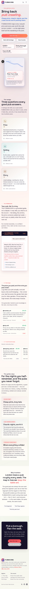
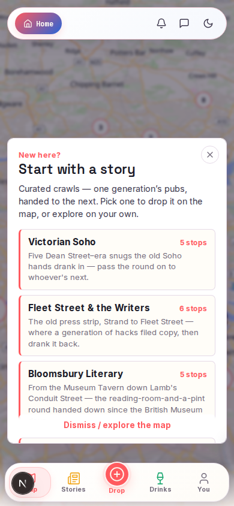
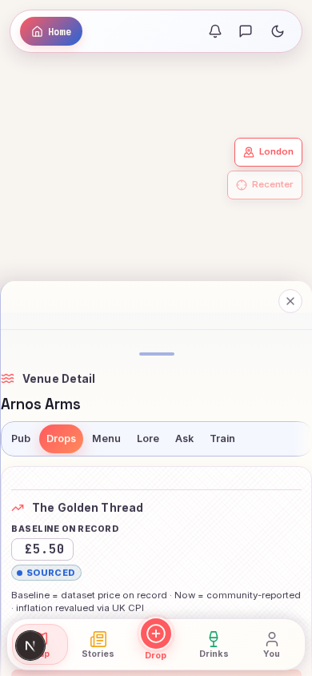
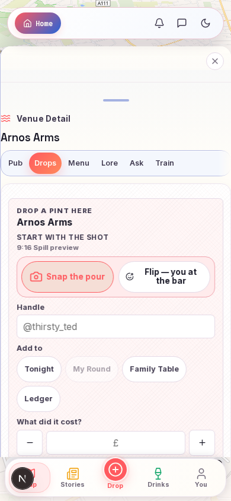

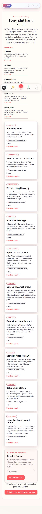
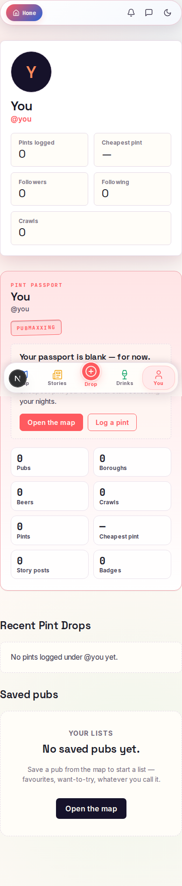
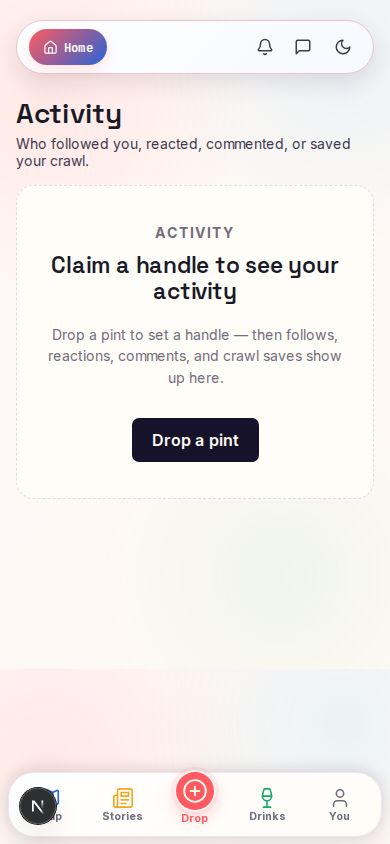

# PubMaxing Screenshots

Reference screenshots for the mobile demo gate (Loop 0). Captured at **390×844**
and **430×932** in light and dark themes via:

```sh
PW_SCREENSHOTS=1 npx playwright test --project=screenshots
```

## Core loop (light, 390)

### Landing



### Map clean



### Map venue sheet



### Map log intent (`/map?log=1`)



### Feed



### Crawls / route packs



### Profile



### Activity



## Also captured

Each of the surfaces above is also saved for:

- light / dark
- 390×844 / 430×932

Filenames follow `{surface}-{theme}-{390|430}.png`.
